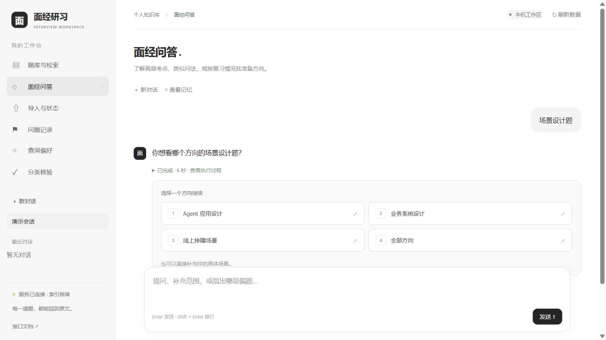
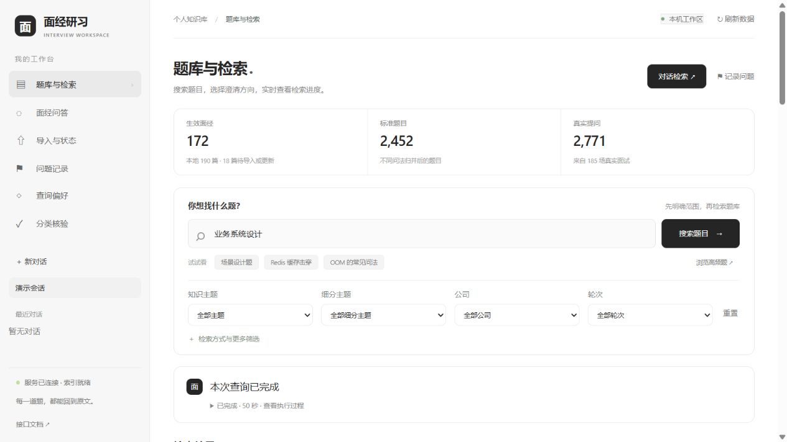
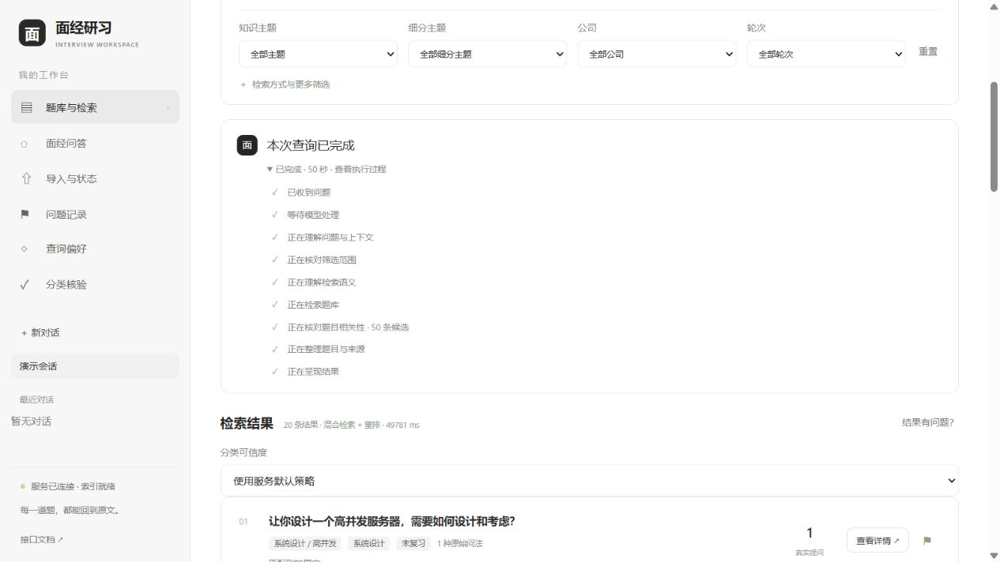
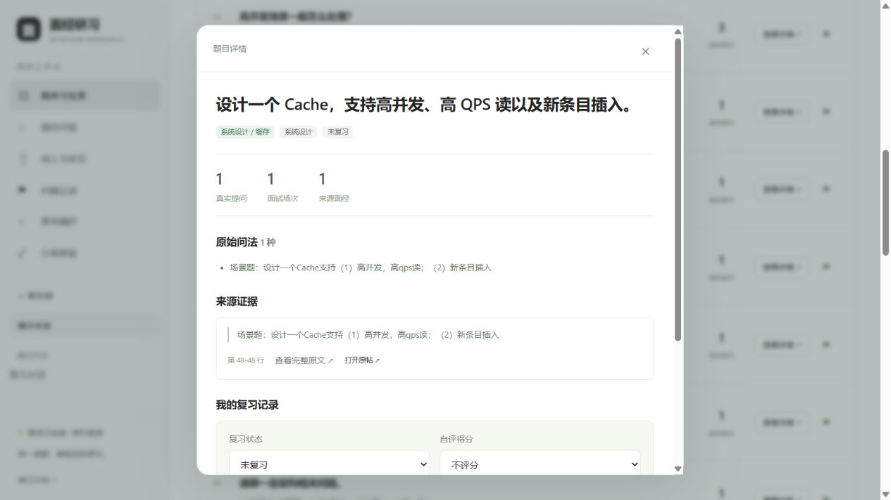
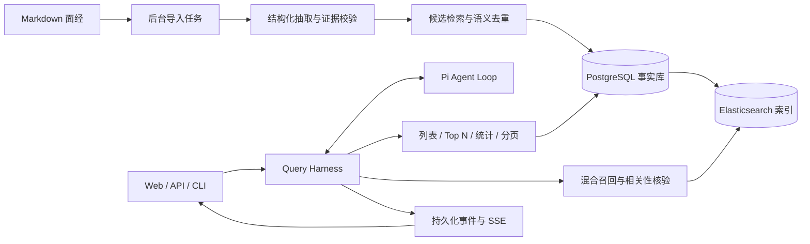

# 面经研习 · Interview Intelligence

**把零散面经整理成可追溯的题库，用自然语言检索、统计和安排复习。**

一个面向个人面试准备的 RAG + Query Agent 工程项目。输入本地 Markdown 面经，系统抽取真实提问、归并不同问法、保留原文证据，再提供题库检索、连续对话和复习记录。

例如，输入“工程系统设计题，类似设计一个排行榜这种”，按工程设计这一宽类别找题；明确“只要排行榜”时限定对象，问“解释如何设计排行榜”时给出参考解答。仅输入“场景设计题”、范围尚不明确时，Agent 提供 **Agent 应用 / 业务系统 / 线上排障 / 全部方向**供选择。

问“Redis 高频题有哪些”时，频次与排名来自数据库中的完整事实，而不是检索到的几个片段。当前 SSH 工程设计检索修复及限制见[验收报告](docs/verification/2026-10-08-engineering-design.md)。

`Python 3.12` · `FastAPI` · `PostgreSQL` · `Elasticsearch` · `Pi Agent Loop` · `Docker Compose`

[快速体验](#快速体验) · [系统设计](#系统设计) · [评测与结果](#评测与结果) · [代码导览](#代码导览)

## 效果展示


**先澄清，再检索。** 选项可以直接点击，也可以继续输入具体需求；等待期间显示真实执行阶段，支持停止和恢复同一请求。



<details>
<summary>题库检索与原文溯源</summary>

题库支持结构化筛选、真实频次、检索进度和反馈；题目详情可以回到原始问法与来源。



一次真实检索完成后，展开查看已记录的执行阶段与耗时：





</details>

效果图来自本地实际页面。真实语料、个人会话与凭据不随仓库分发；无模型凭据也可以运行下面的隔离界面示例和离线测试。

## 能做什么

| 场景 | 实现 |
| --- | --- |
| 从面经建立题库 | 后台任务完成抽取、分类、去重与发布；文件指纹避免重复处理，不完整模型响应不入库。 |
| 查题与比较问法 | BM25、Dense、RRF Hybrid 和 Hybrid + Rerank 四条路径；展示标准题、原始问法、匹配证据和来源。 |
| 统计与连续筛选 | PostgreSQL 计算完整范围的频次、Top N、分组和分页；支持“只看二面”“下一页”等上下文操作。 |
| 对话与进度 | 必要时先澄清；SSE 展示执行阶段和澄清问句增量；事件持久化，支持取消、断线恢复与历史会话。 |
| 反馈与记忆 | 反馈绑定原问题、完整结果和版本；支持纠正后重检、明确保存偏好、停用查询记忆和导出回归样本。 |
| 复习与分类核验 | 保存掌握状态、评分和笔记；机器分类可核对原文、保存草稿并发布人工核验版本。 |

## 系统设计



### 1. 统计走 SQL，语义检索走 RAG

`QuestionOccurrence` 表示某场真实面试中的一次提问，`CanonicalQuestion` 表示归并后的标准题。两者分开，既保留频次，又能合并不同问法。

“字节二面”这样的组合筛选必须命中**同一次 occurrence**，不能把不同场次的公司、轮次拼在一起。SQL 先计算符合条件的题目范围，BM25 与向量检索共用这个范围；完整频次与排名始终由 SQL 计算。

### 2. 模型负责规划，主机负责约束与执行

使用固定版本的 [Pi Agent Loop](vendor/PI-SOURCE.md) 进行工具调用，项目实现领域工具和 Harness：

- **结构化 QueryState**：保存筛选范围、当前页、分页游标和待澄清目标，短答可以继续原需求。
- **Context Compiler**：投影必要状态和有限历史，主体上限 24,000 UTF-8 bytes；签名游标留在主机，不交给模型改写。
- **动态工具权限**：按状态开放详情、翻页和复习写入；主机执行前再次检查，当前请求明确授权才允许修改复习状态。
- **请求幂等与预算**：约束整轮期限、调用次数、tokens 和工具次数；API 与 worker 共用模型调用门，防止多进程绕过并发限制。

### 3. 相关性需要证据，反馈需要可回放

混合召回后，对同一 Top 50 候选核验其题干中的对象与任务证据；主机检查引用是否为原文片段。引用真实仍可能判断不相关，因此同时保留语义评测和坏案例。

会话状态、长期偏好、查询纠正分别保存。只有明确选择“记住”的纠正才跨会话生效，且可以停用；反馈与重检回执可导出为回归样本。当前闭环是 **反馈 → 纠正 → 重检 → 评测**，模型、提示词和全局策略的更新仍需单独验证。

### 4. 发布原子化，来源可追溯

原始文件按 SHA-256 保存不可变快照，抽取结果带原文位置。结构和证据校验通过后才原子发布新构建；重复导入不增加事实。索引落后于事实版本时明确提示同步状态，避免悄悄混用版本。

## 快速体验

### 无凭据体验界面

需要 Python 3.12 和 [uv](https://docs.astral.sh/uv/)。以下服务使用临时数据库和示例数据，不调用真实模型，也不写入个人语料：

```bash
git clone https://github.com/maomaozhe/interview-helper.git
cd interview-helper
uv sync --locked --extra dev
uv run --locked --extra dev python tests/web/smoke_server.py
```

打开[示例题库](http://localhost:8011/#library)，可以浏览示例题目、筛选并查看详情。此模式用于体验界面与数据链路；真实 Agent 对话需要下面的模型服务配置。

### 启动完整服务

需要 Docker Compose。复制配置，填写兼容接口的模型 endpoint、API key、各模型名称、embedding 维度，以及正数调用 / token 预算；`APP_SIGNING_KEY` 和 `INTERNAL_AGENT_TOKEN` 请使用独立随机值。

```bash
cp .env.example .env
# 编辑 .env 后启动：
docker compose up -d --build --wait
```

将你有权使用的 Markdown 面经放入 `md/`，打开[完整服务首页](http://localhost:8000/)，在“导入与状态”提交导入。初次导入需要实际模型调用，耗时和用量取决于语料规模。

| 入口 | 地址 / 命令 |
| --- | --- |
| 题库与检索 | [题库页面](http://localhost:8000/#library) |
| 面经问答 | [对话页面](http://localhost:8000/#chat) |
| OpenAPI 文档 | [API 文档](http://localhost:8000/docs) |
| 服务状态 | `docker compose exec api ii status` |
| CLI 查询 | `docker compose exec api ii chat "Redis 高频问题有哪些"` |

配置、Windows / WSL 启动和模型调用约束见 [开发与运行说明](docs/development.md)。默认任务标签政策为 `VERIFIED`；新语料的机器分类需要核验发布，开发试验可显式使用 `KNOWN`，两种口径不能混为人工核验。

## 评测与结果

评测覆盖**抽取、任务分类、语义去重、检索、查询 Agent 和 Exact SQL**六层。协议、数据版本、预测和判断池分别留档，保留失败样本与回归差异。

| 检查 | 已记录结果 | 口径与证据 |
| --- | --- | --- |
| 语料规模 | 172 篇生效面经、185 场面试、2,771 次提问、2,452 道标准题 | 开发快照 corpus / index revision 293；[快照与实验记录](docs/verification/2026-10-06-quality-refinement.md)。 |
| 完整 SQL 范围 | 20 组排序、计数和全分页核对通过；模型调用 0 | 独立事实 oracle；标签正确性另行评测。[SQL 验证](docs/verification/2026-10-06-resume-quality.md)。 |
| 去重候选性能 | 候选计算 P95：330.11 ms → 114.17 ms | 2,668 条缓存向量、60 次探针，Python 精确扫描对比 HNSW + 精确增量；不是完整请求延迟。小语料默认走向量化精确路径。[实验细节](docs/verification/2026-10-06-resume-quality.md)。 |
| 检索消融 | 扩充判断池后，Dense / Hybrid + Rerank 的 Recall@10 为 69.04% / 60.29% | 同一 55 查询集，四路 Top 10 增补 828 条判断；重排过滤存在召回损失。[四路对比](docs/verification/2026-10-06-quality-optimization.md)。 |
| 本地检索定向修复 | 同23轮确认相关39/48→69/80，参照16/19→19/19；宏平均89.17%→87.98%，SEARCH中位41.1→49.0秒 | 修复推断硬筛漏题与异常隔离；仍有6邻近、5不确定及旧题损失，H01保持开放。两宽查询独立为34/35相关；开发Agent审核。[完整修复报告](docs/verification/2026-10-08-retrieval-fixes.md)。 |
| 工程系统设计题修复（SSH） | 原会话从 1 道变为 17 道主设计题；11 轮隔离回归通过，原 3 轮历史保留 | 先核原文冻结 69 题参考，其中主设计 23 道；线上命中 17/23，独立覆盖请求命中 15/23、另含 1 道邻近题。本次线上耗时 138 秒，仍有漏召回；query v13 / rerank r14。[问题、改进与评测](docs/verification/2026-10-08-engineering-design.md)。 |
| 页面交互 | 澄清点选、同会话继续检索、真实阶段展示通过 | 真实模型与本地题库验收；[问答交互](docs/verification/2026-10-08-chat-interaction.md)、[题库入口](docs/verification/2026-10-08-library-deployment.md)。 |

这些是固定开发语料上的实验，参考标注主要由 Agent 审核，`human_verified=false`。**完整 V1 质量门禁仍为 BLOCKED**；已见回归、首次测试和修订后重评分分别记录，不把局部通过当作生产质量或全库泛化结论。[门禁结果](docs/verification/2026-10-06-quality-gate-v4.json)与[评测操作手册](eval/README.md)提供详细口径。

### 本地验证

Pi 构建步骤在 Linux / WSL 中验证；Windows 可以先运行 Python 测试和无凭据界面。

```bash
uv run --locked --extra dev pytest -q

npm ci --ignore-scripts --legacy-peer-deps
npm run build:pi
npm run check
node --test tests/node/pi-runtime.test.mjs tests/web/test_core.cjs tests/web/test_query_stream.cjs

# 无凭据生成六层合成评测报告；每次使用新的输出目录：
uv run --locked --extra dev python -m eval.demo --output data/reports/evaluation-demo-new
```

GitHub Actions 执行离线工程验证和合成报告。合成数据用于验证评分流程；真实质量实验需要自行准备语料、模型服务和冻结参考集，历史本地 `data/reports/` 不随仓库分发。

## 代码导览

```text
src/interview_intelligence/
├── agent/          # QueryState、Harness、工具、事件与记忆
├── analytics/      # 完整范围统计、列表、分页与详情
├── extraction/     # 结构化抽取与原文校验
├── dedup/          # 候选策略与语义归并
├── ingestion/      # 导入任务、快照与原子发布
├── search/         # BM25 / Dense / RRF / Rerank
├── domain/         # 事实模型与持久状态
└── web/            # 同源 Web 工作台与 SSE 客户端
eval/               # 快照、采集、评分、比较与发布门禁
tests/              # 离线单元、集成、Pi 与前端测试
docs/               # Spec、决策、评测、复盘与演示
vendor/pi/          # 固定版本的上游 Agent Loop
```

阅读建议：先看 [QueryService](src/interview_intelligence/agent/query_service.py) 与 [Harness](src/interview_intelligence/agent/harness.py)，再看 [检索服务](src/interview_intelligence/search/service.py)、[事实模型](src/interview_intelligence/domain/models.py) 和 [评测入口](eval/README.md)。

[实现规范](docs/implementation-spec-v1.md) · [Agent 设计](docs/plans/2026-10-04-pi-agent-spec.md) · [设计复盘](docs/retrospectives/2026-10-04-query-agent.md) · [坏案例](docs/bad-cases.md) · [实施状态](docs/implementation-status.md)

当前主要改进方向是复杂语义召回、任务分类的人工核验覆盖、相关性核验延迟，以及生产级多实例任务恢复。项目适合本地个人工作区使用，尚未提供面向公网的多租户认证与容量保证。
