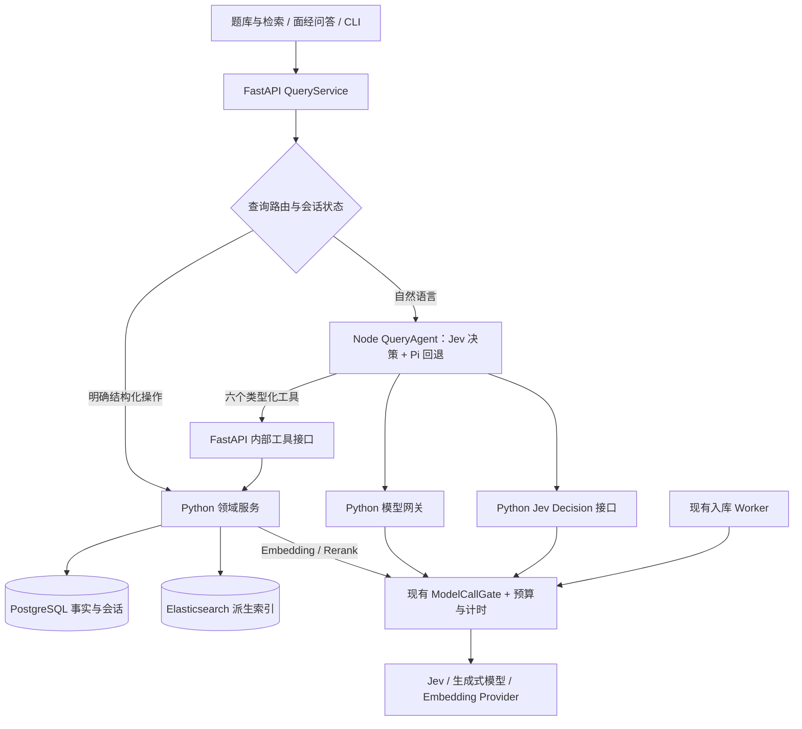

# Pi 接入调研与 Agent 查询层 Spec

- 状态：查询 MVP 已实现并部署到本地开发栈；第 16 节记录实际范围与验证。长期偏好和完整上线评估仍为后续设计。
- 日期：2026-10-04。
- 目标：让“题库与检索”和“面经问答”共享查询能力，支持准确的编码题列表、多轮筛选、分页和有依据的复杂检索。
- 推荐：引入固定 Pi 源码，使用 `pi-agent-core` + `pi-ai` 新增 Node QueryAgent；自然语言由模型判断路由，评估 Jev 快速决策 + Pi 回退；Python 管理业务、数据和模型调用限流。
- 本轮修订依据：[Pi + Jev 深入调研](./2026-10-04-pi-jev-research.md)，包含中文限制、源码构建方案及 Top 40 隔离实验。
- 开源部署实测：[System One 方案比较与 L20 中文评测](./2026-10-04-open-system-one-deployment.md)。当前开发栈查询开关启用 Pi，Laya 决策默认关闭。

## 1. 决策摘要

引入 Pi 作为有限工具集的 Agent 运行库。自然语言统一由 QueryAgent 中的模型理解意图、参数及会话状态变化，再将类别查询、翻页、统计交给数据库服务。首期比较 Pi 模型直接路由与 Jev 快速决策 + Pi 回退；明确结构化按钮请求可直接调用工具。

Pi 能提供模型与工具之间的执行循环、事件、取消和上下文钩子。它不能自动修复现有题型标注、补齐 SQL 分页，或把 Agent 内存变成持久记忆。因此实施包含三项业务前置改造：编码任务分类、列表查询与分页、分阶段计时。

第一阶段接入范围：

1. SQL 类别列表、总数、统计及稳定分页。
2. 保留混合检索，按查询用途决定是否重排。
3. QueryAgent 与 Pi 共享六个领域工具，支持模型路由、状态修改和有限的多步查询；Jev 是否启用由中文完整查询计划评测决定。
4. PostgreSQL 保存会话及结构化查询状态；明确表达的长期偏好可查看、修改、删除。
5. 所有模型请求复用现有串行调用门和预算记录。

原始 Markdown 的分块抽取、自动 Wiki 合成、向量化长期记忆、多 Agent 协作另立需求。本方案完成的是查询与对话层，数据加工仍沿用现有流程。

## 2. 现状与问题依据

以下记录改造前的代码行为，作为问题基线。后续章节保留目标设计；已实现范围见第 16 节。

| 环节 | 现状 | 对本方案的影响 |
| --- | --- | --- |
| 入库 | 整份 Markdown 交给 LLM 抽取；超过 20,000 字符拒绝；保存题目及原文位置 | 当前没有原始文档 Chunk 层；题目级索引不等于原文分块 |
| 数据 | PostgreSQL 保存事实、题目归并和复习状态；Elasticsearch 保存派生索引 | Agent 应调用业务服务获取事实 |
| 检索 | BM25 + dense，RRF 融合，再按配置使用 LLM 重排；PG 补充来源和计数 | Top K 是检索结果数，无法表达“全部有哪些” |
| 题库界面 | 非空输入调用 `/api/questions/search`；默认 `HYBRID_RERANK`、20 条 | 用户的列表意图会走重排，20 条也不是题库总数 |
| 题型 | 抽取规范将手写代码、SQL 统一归为 `ALGORITHM` | 工程编码、算法、SQL 被混在同一旧类别 |
| 现有 Agent | 关键词分支与有限查询改写；“手撕”命中 `ALGORITHM`；部分回答仅展示前 5 项 | 更换运行库仍需修改意图及展示规则 |
| 上下文 | `ChatRequest` 有 `context`，接口实际只向服务传入 message/request_id；前端只发送 message | 当前没有可依赖的多轮查询状态 |
| 浏览统计 | `StatsRequest` 有 cursor，但实现对排序结果切片，未消费 cursor | 不能将已有参数视为分页已完成 |
| 部署 | Python FastAPI + worker，PostgreSQL + ES；现有镜像没有 Node | 接入 Pi 需要独立 Node 运行环境 |

代码依据：[抽取 provider](../../src/interview_intelligence/extraction/provider.py)、[抽取提示词](../../prompts/extract_question_v1.md)、[检索实现](../../src/interview_intelligence/search/elasticsearch.py)、[统计实现](../../src/interview_intelligence/analytics/stats.py)、[Agent](../../src/interview_intelligence/agent/service.py)、[API](../../src/interview_intelligence/api.py)、[前端](../../src/interview_intelligence/web/assets/app.js)、[模型调用门](../../src/interview_intelligence/providers/gate.py)、[Compose](../../compose.yaml)。

此前核对的“手撕代码有哪些题目”题库请求为 `HYBRID_RERANK&top_k=20`。关联模型日志中 Embedding 约 8.3 秒，Rerank 约 118.2 秒；现有计时含调用门等待，不能据此认定 118 秒全部花在模型生成上。这是一条请求的观测值，不能作为整体 P95。接入后的收益必须重新测量。

## 3. Pi 调研结论与选型

调研基线为 [v1.0.2 release](https://github.com/earendil-works/pi/releases/tag/v1.0.2)，发布时间为 2026-10-04 08:56（北京时间），对应提交 `cd32f7725fdbddbaecdff5b1e68491563394e0ca`。以下接口结论均按此版本源码核对。

| 接入方式 | 已核实的能力 | 适用性与结论 |
| --- | --- | --- |
| `pi-agent-core` + `pi-ai` | Agent 循环、工具参数验证、事件、取消、上下文转换、多模型适配 | **采用**。可只注册题库工具，数据库和会话规则由应用控制 |
| `pi-coding-agent` SDK | `createAgentSession`、SessionManager、压缩、扩展及编码工具生态 | 能接入，但需要额外约束资源发现和工具。当前领域查询不需要完整编码助手 |
| Coding Agent RPC | CLI 子进程通过 stdin/stdout JSONL 接入 Python | 可作原型备选；须管理进程、会话、事件背压和恢复。业务服务长期部署维护成本更高 |
| `pi-durable` | 持久会话、任务恢复、文档、压缩；内存/JSONL/SQLite 存储 | 官方标为实验性，且是独立运行体系。本期采用 PG 会话存储；有跨进程任务恢复需求后再评估 |

依据：[Agent README](https://github.com/earendil-works/pi/blob/cd32f7725fdbddbaecdff5b1e68491563394e0ca/packages/agent/README.md)、[SDK 文档](https://github.com/earendil-works/pi/blob/cd32f7725fdbddbaecdff5b1e68491563394e0ca/packages/coding-agent/docs/sdk.md)、[RPC 文档](https://github.com/earendil-works/pi/blob/cd32f7725fdbddbaecdff5b1e68491563394e0ca/packages/coding-agent/docs/rpc.md)、[Durable README](https://github.com/earendil-works/pi/blob/cd32f7725fdbddbaecdff5b1e68491563394e0ca/packages/durable/README.md)。

接入注意事项：

- 此版本包名为 `@earendil-works/*`。推荐以固定提交引入源码、本地 workspace 构建 agent/ai/telemetry，提交 lockfile；验证实际运行包解析到本地源码。第三方依赖按完整性和构建结果锁定。
- Node 要求 `>=22.19.0`，包使用 ESM；当前宿主 Node 22.23.2 满足要求，现有 Python 镜像需要新增配套 Node 镜像。[包元数据](https://github.com/earendil-works/pi/blob/cd32f7725fdbddbaecdff5b1e68491563394e0ca/packages/agent/package.json)
- Agent 默认工具集为空，但工具执行默认可并行。本期显式设置 `toolExecution: "sequential"`，只注入领域工具。
- `Agent.state` 是内存状态；`sessionId` 可用于 provider 缓存关联，不承担数据库持久化。上下文裁剪通过 `transformContext` / `prepareRequest` 等钩子实现。[Agent 源码](https://github.com/earendil-works/pi/blob/cd32f7725fdbddbaecdff5b1e68491563394e0ca/packages/agent/src/agent.ts)
- 工具结果的 `content` 会进入模型上下文；`details` / `structuredContent` 可供应用使用，不能假设模型读到了其中完整数据。[工具类型](https://github.com/earendil-works/pi/blob/cd32f7725fdbddbaecdff5b1e68491563394e0ca/packages/agent/src/types.ts)
- 工具结果 `terminate: true` 可省掉下一次生成，但同批工具结果需要全部终止；混合情况由应用的 `finishTurn` 明确结束。[执行循环](https://github.com/earendil-works/pi/blob/cd32f7725fdbddbaecdff5b1e68491563394e0ca/packages/agent/src/agent-loop.ts)
- Pi 支持自定义 provider 和 OpenAI 兼容配置；现有服务能使用 JSON Schema，不代表已验证原生 tool calls、流式返回及工具消息兼容。[Pi AI 文档](https://github.com/earendil-works/pi/blob/cd32f7725fdbddbaecdff5b1e68491563394e0ca/packages/ai/README.md)
- Pi telemetry 提供事件/Span 接口，应用仍需提供存储及导出；不能把引入它当成可观测性已完成。[Telemetry README](https://github.com/earendil-works/pi/blob/cd32f7725fdbddbaecdff5b1e68491563394e0ca/packages/telemetry/README.md)

上述为设计时的源码调研结论。后续已完成本地源码构建和真实 provider 工具调用，验证结果见第 16 节。

## 4. 目标架构



新增 `services/pi-agent/`，承载 QueryAgent、Pi SDK、决策编译、工具适配、上下文组装和运行事件。以 subtree 固定完整上游快照至 `vendor/pi`，集成本地 agent/ai/telemetry 构建。Node 不直连 PG/ES，不持有上游模型密钥；领域操作和模型调用经 Python 内部接口。

该 Node 服务的 HTTP 协议是本项目新建的适配层，Pi SDK 本身不提供这里约定的业务 HTTP 服务。暂用 HTTP + JSON Schema；当前进程间调用无需另加 MCP 层。

FastAPI 发起 Pi run 后，Pi 可回调 FastAPI 的工具/模型接口。不得在外层请求中持有数据库事务、串行锁或阻塞唯一服务线程等待整个 run。网关与工具接口应具备独立的异步处理能力，阻塞文件锁等待放入受控执行器。

### 4.1 共享路由

| 请求 | 路径 | 模型使用 |
| --- | --- | --- |
| 点击“工程手写代码”、选公司、下一页 | SQL list | 0 次 |
| “手撕代码有哪些题目” | 模型解释类别 → 校验 QuerySpec → SQL list | 通常 1 次 Jev；不确定时 Pi 回退；展示当前解释 |
| “只看腾讯”“下一页”“这些哪些没掌握” | 模型识别状态修改/指代 → SQL 工具 | 通常 1 次 Jev；继承范围和必要参数需验证 |
| “有哪些数据库题，按出现频次排” | 模型选择 topic/排序 → SQL list/stats | 通常 1 次 Jev；不调用 Embedding/Rerank |
| “前 40 个频率最高的算法题” | 模型识别数量/类别/排名 → 全范围 SQL Top N | 显式 top_n=40；≤100 条时默认当页展示请求数量 |
| “和线程安全缓存相关，但排除只问原理的题” | Pi 解析条件 → search/list → 必要时组合 detail | 有界调用 |
| “最近腾讯 Redis 题集中在哪些方向，我哪些还没掌握” | Pi 组合 stats + review 等工具 | 有界调用 |

自然语言的意图、参数和 keep/set/clear 变化由模型判断，程序将原子决策编译为 QuerySpec 并验证组合。数量/日期先找候选，再由模型选择、代码精确归一化；必要字段不可靠时进入 Pi 或澄清，不能静默套默认 20 或删除原句中的限制条件。结构化请求直接按明确参数执行。模型负责决定查什么，事实与总数由工具返回。

“题库与检索”新增统一查询入口；原始 `/api/questions/search` 保留为明确的语义检索接口。列表展示总数/下一页，语义检索展示相关结果数与检索方式。问答复用同一 QueryService，消除两个入口的题型解释差异。

## 5. 编码题分类：先让工具有可靠的数据

在 occurrence 上新增版本化 `QuestionTaskAnnotation`，保留旧 `question_type` 兼容现有调用。单独表达作答形式和编码方向，避免靠 topic 或 LeetCode 编号推断是否要求编码。

| 字段 | 约定 |
| --- | --- |
| `response_form` | `CODE / SQL / EXPLANATION / DESIGN / OTHER / UNKNOWN`；按实际要求作答的形式 |
| `coding_focus` | 多值集合：`ENGINEERING / ALGORITHM`；SQL 通过作答形式筛选；允许工程与算法重叠 |
| `classification_status` | `VERIFIED / NEEDS_REVIEW / UNKNOWN` |
| `evidence_spans` | 引用已有 source revision 上可校验的原文位置 |
| `annotation_version` | 指南、schema、模型/人工标注版本及生成来源 |

分类准则：

- 手写线程池、限流器、并发控制或业务组件 → CODE + ENGINEERING。
- 排序、链表反转、明确的算法求解题 → CODE + ALGORITHM。
- 线程安全 LRU 实现 → 可同时包含 ENGINEERING、ALGORITHM；按查询方向提供匹配依据。
- “解释 LRU 原理” → EXPLANATION，不进入工程手写代码列表。
- 手写 SQL → SQL；是否要求算法不能仅由“手写”推断。
- 没有 LeetCode 编号的算法题仍是算法；只有旧 `ALGORITHM` 标签、证据不够时保留 UNKNOWN。

产品默认解释“手撕代码”为 `response_form=CODE AND coding_focus contains ENGINEERING`，体现本次用户期望。页面显示“按工程手写代码筛选”，允许切换“算法题 / SQL / 全部编码题”。“算法题”“LeetCode”明确覆盖默认解释；用户也可保存自己的长期偏好。

回填优先复用已抽取题目和证据，对含混样本做补充标注。无需为增加任务标签重新执行整份文档抽取、题目归并或更换 canonical ID。回填扫描全部有效 occurrences，不能只扫描旧 ALGORITHM，否则会漏掉标为其他任务的编码题。

发布时原子切换 annotation version，并推进查询数据版本；影响 eligibility 的标签同时反映到索引投影。回填未完成时暴露 `classification_coverage`、未知数量及当前范围；总数仅指已发布标注版本中的匹配题目，不能宣称覆盖所有原文编码题。

默认类别列表使用已发布且已验证的任务标注，待核验/未知项提供单独查看范围。LLM 给出标签不等于标注已经完成核验；发布指南明确证据验证和质量门槛。

公司、时间、编码要求等限制必须命中同一条 occurrence。不能因为某个 canonical 在腾讯出现过、在其他公司要求手写，就认定腾讯要求手写。

## 6. 列表、检索与工具契约

### 6.1 SQL 列表

新增 `list_questions(filters, review_filter?, sort, top_n?, page_size=20, cursor?)`。默认 frequency，支持现有 importance/gap 排序；page_size 范围 1–100。显式请求 N≤100 个时默认 page_size=N；top_n 表示整个选中集合，page_size 只控制当页。SQL 在全部有效筛选范围聚合，默认真实提问频次降序、canonical ID 升序，最后取 Top N；不能先做检索 Top K 再算频次。

响应必须包括：`items`、`total_questions`（distinct canonical）、`total_occurrences`、`has_more`、`next_cursor`、`applied_filters`、`corpus_revision`、`annotation_version`。Top N 额外返回 requested_top_n、selected_total、returned_count 和名次范围；少于 N 时明确说明，默认并列按稳定 ID 取精确 N。涉及复习条件/缺口排序时还包括 `user_state_revision`。列表行提供匹配原句、匹配频次和轻量来源摘要，详情按需加载，避免每行调用完整 detail。

cursor 为签名的不透明数据，绑定规范化 filters、sort、top_n/计数指标/并列策略、page_size、最后排序键、语料/标注版本、必要的用户状态版本和截止时间。分页要求在同一发布快照上查询；快照已变化返回 `STALE_CURSOR`（409），客户端重载第一页。修改筛选后清空 cursor。计数和当页使用同一数据库一致性快照。

频次分页以聚合 SQL + keyset 实现；importance/gap 需使用版本固定的排序计算或缓存排序快照。不能把全库聚合加载至 Python 后切片，视作新的数据库分页实现。列表永不调用 Embedding 或 Rerank。

### 6.2 语义检索

保留当前 BM25/dense/RRF 服务，在已筛选的有效 canonical 范围检索。默认复杂检索先使用 HYBRID；精确术语可用 BM25。Rerank 为独立策略，首期只在用户请求更精确排序或显式启用时运行，避免给所有请求新增判断用的 LLM 调用。

候选数、重排模型、是否启用轻量重排均由离线金标评估决定。重排失败或预算不足，保留可用的融合结果并返回 `rerank_status=SKIPPED_BUDGET/FAILED`。纯 Top K 检索不返回未经数据库验证的“全部共有 N 题”。需要列出全部某类题时转 SQL list。

### 6.3 Pi 工具

| 工具 | 输入与职责 | 结果与终止行为 |
| --- | --- | --- |
| `list_questions` | FilterSpec 扩展、复习筛选、sort/指标、top_n、page_size、cursor | SQL 完整范围的排名与分页；纯列表可直接结束 |
| `search_questions` | query、filters、top_k（1–50）、rerank 策略 | 有界相关结果、匹配来源、执行路径；可继续分析或直接展示 |
| `get_question_stats` | filters、group_by、time_bucket | 真实聚合计数/分布；统计表可直接结束 |
| `get_question_details` | canonical IDs（1–10）、scope | 题目、匹配原句、来源、追问；受数量/字符预算约束 |
| `get_review_state` | canonical IDs（1–100）或可信 result_set_id | 当前用户状态及版本 |
| `record_review` | 可识别题目 IDs（1–20）、状态、expected_version | 沿用幂等复习写入；成功依据是数据库回执 |

这六项是新 Agent 的工具集合；现有 overview 等 HTTP 能力可继续存在，其数据通过 stats/detail 等适配复用。模型无任意 SQL、代码执行、文件读写工具。

工具 schema 以 Python Pydantic 契约为源，构建时导出 JSON Schema；Node 适配为 Pi 接受的 schema，验证 `$defs`、引用、nullable、枚举及未知字段行为，避免手写两套逐渐漂移的契约。Python 每次再次验证输入；用户身份、run ID、数据版本和幂等键来自可信请求上下文，不交给模型填入。

Pi 的 `content` 放入有界事实摘要和引用 ID；完整 rows、计数、分页信息放入 `details/structuredContent`，供页面渲染和 PG 存储。需要模型分析的数据也必须放在 content 的限额内，不能只放 structuredContent。原文属于证据数据，不可改变系统指令或工具边界。

直接可展示的列表/统计结果由宿主决定结束，使用 `terminate`/`finishTurn`，无需再调用 LLM 复述整页。多工具分析允许继续生成，但数字和来源必须与工具结果核对；不确定的题号保留 null。

## 7. 上下文与记忆

### 7.1 结构化会话状态

PostgreSQL 保存 `Conversation` 和 `ConversationEntry`，每轮同时保存 `QueryState`。Node 每个 run 从 PG 读取上下文并创建独立 Agent；不能复用跨用户的可变 Agent 对象。

QueryState 至少包含：`intent`、规范化 filters、sort、page_size、cursor、当前页 IDs、`result_set_id`、`last_tool`、语料/标注/用户状态版本，以及筛选条件的来源。快速路径也写入这些状态，后续切入 Pi 时仍能理解先前操作。

会话中的“这些”默认指当前显示的一页；“这类全部”指当前筛选集合。`result_set_id` 由后端签发，绑定范围和版本。两者不可混淆，页面要显示当前动作的范围。超过写入上限的“这些都已掌握”按已确认范围分批处理，保留每批回执。

条件优先级：当前明确输入 > 本轮澄清 > 会话状态 > 已保存偏好 > 产品默认。添加公司/日期保留其他限制；更换主题清除不适用条件；新会话不继承旧页 cursor。语料变更后保留合法筛选，失效结果引用和页码重新查询。

### 7.2 模型上下文

组装 system 指令、当前 QueryState、相关偏好、最近完整消息组和有界工具摘要。最近 6–10 轮仅作为初始策略，实际由已验证模型的 token 上限约束，保留回答及工具结果预算。工具调用和对应结果必须成组保留，不能产生孤立 tool 消息。

`transformContext` 用于裁剪/转换模型可见消息；`prepareRequest` 用于最终预算检查和请求配置。完整审计消息仍保存在 PG。优先用确定性 QueryState 替代重复历史；默认不为每轮额外调用模型写摘要。确需压缩时单独计费计时，并保留当前筛选、显示范围和写入回执。

`sessionId` 使用稳定的 conversation ID 关联 provider 缓存；缓存命中属于性能策略，会话恢复仍以 PG 为准。

### 7.3 持久偏好

新增 `UserPreference`：key、value、来源消息、创建/更新时间、版本、可选有效期。首期仅保存用户明确要求记住的稳定偏好，例如“以后手撕默认看工程代码”“主要准备 Java 后端”。一次临时筛选不自动变为永久偏好。

偏好可在页面查看、修改、删除；“这次看算法”覆盖当轮默认，不改永久值。个人掌握状态继续使用现有 review 表，不复制成另一套记忆。原文、canonical、统计总数继续使用事实表，不写入模糊的记忆摘要。

首期长期记忆采用结构化字段，不增加 memory 向量库。偏好写入通过明确的 API/宿主命令处理，不注册一个可由模型自由写入任意记忆的工具。

## 8. 模型网关、兼容性与预算

### 8.1 模型调用路径

新增 Python 内部 OpenAI 兼容网关，例如 `/internal/agent-model/v1/chat/completions`。Pi AI 注册自定义 provider，baseUrl 指向此网关；网关再调用现有上游配置。`Model` 的 contextWindow、maxTokens、reasoning 与兼容参数按实测配置，不能凭接口名字猜测。

Node 使用 `createProvider`、`createModels`、`openAICompletionsApi()` 注册模型，并把对应的 `streamSimple` 传给 `Agent`。这是实现方向，具体 imports 和类型必须以锁定版本编译验证。[自定义模型实现](https://github.com/earendil-works/pi/blob/cd32f7725fdbddbaecdff5b1e68491563394e0ca/packages/ai/src/models.ts)、[OpenAI adapter](https://github.com/earendil-works/pi/blob/cd32f7725fdbddbaecdff5b1e68491563394e0ca/packages/ai/src/api/openai-completions.ts)

所有 Pi、Embedding、Rerank、入库模型请求都必须进入现有 `ModelCallGate`，在 Linux 部署中共享 `model_runtime` 的 `/app/runtime/model-call.lock`，保持最大并发 1、请求完成后间隔 2 秒。Node 不能直连上游绕过该门。

锁只覆盖单次上游模型请求，流式请求直到结束/取消清理后释放。执行工具前释放锁；否则工具内 Embedding/Rerank 会等待自己持有的锁。不得在整轮 Agent 外层持锁。

现有调用门没有可取消的有界排队接口。实施需新增 deadline、AbortSignal 对应的取消检查、队列/间隔独立计时；Linux 锁等待改为可检查截止时间的非阻塞轮询。取消不能只停止页面 SSE 后留下后台请求继续跑。

### 8.2 必须完成的 provider 验证

M0 使用当前配置的真实 provider 验证：原生 tools、assistant tool_calls → tool result 消息、流式参数拼装、usage、取消、超时、服务端错误。流式 JSON 片段只有在最终工具调用完成且通过验证后执行。

根据实测设置 `supportsDeveloperRole`、`supportsReasoningEffort`、`supportsUsageInStreaming`、`supportsStrictMode`、`maxTokensField` 等 compat 参数。工具采样支持 strict 才设 `strict: "require"`，否则采用 prefer + 应用验证 + 有限修复。

Pi 的 `thinkingLevel: "off"` 不能单独证明上游关闭了推理；网关须验证实际请求 payload 与 provider 行为。未知价格不报告为免费，未知 usage 不报告为零；Pi 模型描述所需的价格占位值不得流入产品计费报告。

此版本 OpenAI adapter 显式关闭 SDK 内部重试，改用可取消的 Pi 重试封装，其默认重试次数也是 0。本期显式配置 `maxRetries: 0`，Python 网关同样关闭自动重试；后续如开放重试，所有真实 attempts 都计入预算和计时。网关给逻辑模型调用分配稳定 ID，流中断不得盲目重放部分结果。[重试源码](https://github.com/earendil-works/pi/blob/cd32f7725fdbddbaecdff5b1e68491563394e0ca/packages/ai/src/utils/provider-retry.ts)

若当前模型不支持稳定的原生工具调用，保留快速路径与旧查询服务；先完成模型兼容决策，不能将手写文本解析包装成“已验证 Pi tool calling”。

### 8.3 初始运行预算

预算由宿主执行，模型不能增加；以下为拟议默认值，配置可调整。

| 项目 | 默认约束 |
| --- | --- |
| 整轮 deadline | 60 秒，含排队、模型、工具；到期返回已完成结果/明确失败状态 |
| Pi 模型调用 | 最多 2 次正常调用，额外最多 1 次参数修复 |
| Jev 决策 | 最多 1 次；按必要字段置信度及完整计划校验决定接受/回退 |
| Embedding / Rerank | 每轮各最多 1 次；所有真实模型 attempts 总计不超过 6 |
| 工具调用 | 最多 8 次；记录每次输入、结果与剩余预算 |
| Rerank | 首期默认关闭；显式开启仍受总 deadline 约束 |
| 排队 | 超过剩余预算则不发起模型请求；不得取消后排队继续执行 |

明确结构化类别列表无需模型预算；自然语言列表使用 decision/路由预算，SQL 执行本身不使用模型。复杂 Agent 只有完成事实获取才可生成最终答案；预算耗尽时展示已完成结果及未完成项，不能填补猜测结果。数据抽取作业继续沿用其现有独立任务预算。

### 8.4 Jev Decision Gateway

Jev 使用独立 System One API，不注册为 Pi 的普通文本生成模型。Python DecisionProvider 可使用 REST 或官方异步 SDK，固定实际模型版本，关闭自动重试，并接入同一 ModelCallGate。先验证中文意图、数量、状态更新和完整计划质量，再启用 Jev；未达到门槛时由 Pi 模型承担自然语言路由。字段级概率、选项/指令版本、回退原因和完整 QuerySpec 均需记录。[深入调研](./2026-10-04-pi-jev-research.md)

## 9. 会话持久化、幂等与失败恢复

新增表/实体：

| 实体 | 最低职责 |
| --- | --- |
| `Conversation` | 当前 QueryState、版本、活跃 run lease；同一会话只允许一个运行中的修改轮次 |
| `ConversationEntry` | 顺序消息/工具结果，provider transcript 与应用结果引用 |
| `AgentRun` | client request ID、路由、状态、deadline、模型配置、使用量、trace ID |
| `ToolInvocation` | 调用参数 hash、工具结果引用、状态；写操作的稳定 action ID 和业务回执 |
| `UserPreference` | 用户可管理的明确偏好 |
| `QuestionTaskAnnotation` | 前述 occurrence 分类及版本 |

发起请求先以 `conversation_id + client_request_id` 幂等接受；重发返回原 run。短事务提交消息/状态，再发起网络调用。持有会话 lease 时以版本 CAS 更新，拒绝同会话并发覆盖；不同会话隔离。

订阅 Pi 完整消息/工具事件，持久化后再推进后续动作；源码中的 Agent 订阅回调可以 await。消息持久化失败则终止 run。工具写入意图在调用前保存，结果在应用回执后保存；最终 `completed` 事件只在最终消息及 QueryState 落库后发送。增量文本属于临时展示。

`record_review` 的 idempotency key 由宿主生成并持久化，绑定稳定 action ID 和 payload hash；重试复用同一 key。结果不明时查询业务回执，不能由新一次模型决策创建新写入。用户明确提出复习状态更新即可执行，题目范围含混时先澄清范围。

进程重启把失去 lease 的 run 标为 INTERRUPTED。首期支持重新提交/继续查询并恢复会话事实，不承诺在任意流片段处自动续跑。读取操作可按版本重新查询；写操作先查回执。该边界让本期无需引入完整 durable task runtime。

工具或模型失败分别返回错误码；语料版本冲突重查或提示刷新。Pi 服务不可用时，确定性列表仍可用，复杂查询返回显式降级到现有检索服务的状态。不能把未完成的写操作呈现为成功。

## 10. 拟议接口与前端行为

以下均为本项目新增契约，不是 Pi 原生 RPC：

- `POST /api/query`：题库自然语言/结构化查询，返回统一的 list/search/stats/clarification 结果。
- `POST /api/conversations`：创建会话。
- `POST /api/conversations/{id}/messages`：提交 `client_request_id`、message 和可选明确筛选，返回 run ID；结果以事件流或轮询获取。
- `GET /api/runs/{id}/events`：SSE，包含 accepted、stage、tool_result、text_delta、completed、failed/interrupted。
- `POST /api/runs/{id}/cancel`：取消排队、模型及工具读取。
- `GET/PATCH/DELETE /api/preferences/{key}`：查看、更新和删除明确偏好。
- 内部：Pi run 启动/取消、类型化工具、会话事件持久化及模型网关；内部服务身份与用户会话绑定分开验证。

统一结果至少具有以下结构（数值为示例，不代表真实题库规模）：

```json
{
  "kind": "list",
  "data": {
    "items": [
      {
        "canonical_question_id": "cq-demo-01",
        "canonical_text": "实现线程安全缓存"
      }
    ],
    "total_questions": 47,
    "total_occurrences": 81,
    "has_more": true,
    "next_cursor": "opaque-signed-cursor"
  },
  "meta": {
    "request_id": "...",
    "conversation_id": "...",
    "corpus_revision": 293,
    "annotation_version": "task-v1",
    "page_size": 1,
    "applied_filters": {
      "response_form": "CODE",
      "coding_focus": ["ENGINEERING"]
    },
    "route": "SQL_LIST",
    "completion_status": "COMPLETE"
  }
}
```

页面初始加载 20 条并显示“共 N 题”，通过下一页/加载更多访问剩余结果；不会一次把所有 rows 填入模型上下文。题库可以只保存查询状态；用户从当前结果继续问答时，将筛选和显示范围绑定到会话。

聊天不再发送可由客户端任意替换的历史消息数组，而发送 conversation ID。旧 `/api/agent/chat` 在迁移期作为新服务适配入口，旧 context 参数明确弃用；原有 stats/search/detail/review API 保持兼容。

## 11. 性能与可观测性

每个请求记录同一 trace 下的关键耗时：HTTP 接受、路由、上下文加载、队列等待、2 秒间隔等待、上游 TTFT/总时长、每次重试、SQL eligibility/聚合、Embedding、BM25/dense、融合、Rerank、详情补充、结果持久化、页面首结果和完成时间。

修正现有单字段 duration：增加 `queue_wait_ms`、`interval_wait_ms`、`provider_ms`、`attempt`、`cache_hit`、usage 来源及未知状态。总时长按请求关键路径计算，不能把可能重叠的 spans 简单相加。API/worker/Node 共用 request/run/model-call ID。

缓存原则：Embedding 绑定模型/维度/规范化输入版本；检索及重排绑定 filters、语料/索引/标注版本、策略和候选内容；列表绑定筛选与排序版本；个性化结果额外绑定 user_state_revision。新回填和复习更新不得命中过期缓存。

先收集现有与改造后同一查询集的冷/热缓存 P50/P95、模型调用数、排队比例和质量指标，再决定是否更换重排模型/减少候选。以下是开发验收目标，尚无实测支持：

- 本机正常负载下 SQL 列表服务 P95 ≤ 500ms，明确结构化操作的页面首结果 P95 ≤ 1s；报告同时写明语料规模、索引、硬件和负载。
- 明确结构化类别/翻页/统计请求模型调用数为 0；自然语言通常一次决策调用，不使用 Embedding/Rerank。
- 自然语言端到端计时包含 Jev/Pi 路由及全局排队/间隔；不能直接套用供应商毫秒级模型时延。
- Agent 的总调用次数及耗时符合预算；分别报告排队和 provider 时间，不给出未验证的秒级回答承诺。
- 与现有 HYBRID_RERANK 在同一金标集比较相关性，改变默认策略需记录收益和退化样本。

## 12. 实施拆分

| 阶段 | 改动与产物 | 完成条件 |
| --- | --- | --- |
| M0：兼容性验证 | 固定 Pi 源码与本地包构建、最小 Agent、Python 模型/decision 网关、中文 QuerySpec 对照评测、全局 gate 与取消 | 能调用一个领域读工具；终止可省一次生成；串行/取消/流式验证通过；确定 Jev 或 Pi 路由默认策略 |
| M1：业务基础 | occurrence 编码分类、版本化回填、SQL list/精确总数/cursor、阶段计时 | 工程代码/算法/SQL 可分别筛选，列表能越过 20 条，旧 API 兼容 |
| M2：共享 Agent 查询层 | QueryAgent/QueryService、六个内部工具、Pi sidecar、会话/状态、两入口复用、统一事件结果 | 自然语言模型路由、多轮筛选、Top N、指代、统计及语义检索工作；结构化操作无模型请求 |
| M3：上线评估 | 偏好 UI、金标与性能报告、运行预算、幂等/重启验证、功能开关 | 明确默认策略和回滚条件；灰度数据满足验收 |

M0 和 M1 是进入 M2 的前置条件。M0 失败不阻塞 M1 的列表与分类改造，但不得宣布 Pi 已完成接入。建议先提交独立的 M0 验证变更，再分批提交 M1/M2，避免一次同时重写 Agent、分类和检索。

拟改文件范围：

- `services/pi-agent/`：package.json/lockfile、运行入口、provider、工具 schema/适配、context、事件与预算；新增 Dockerfile 和 Node 测试。
- `vendor/pi/` 与集成 workspace：固定上游源码、来源/许可证、构建与解析路径校验；必要补丁独立记录。
- `src/interview_intelligence/agent/`：共享 QueryService、状态/偏好、内部工具调用适配；旧关键词实现变为兼容路径。
- `contracts/`、`analytics/`、`search/`：扩展筛选、SQL list、分页、重排策略及计时。
- `providers/`、`api.py`、`domain/models.py`、`migrations/`：网关、可取消 gate、会话/运行表、接口。
- `prompts/`、`ingestion/`、回填命令：新标注指南及增量任务标签发布；不改 canonical 身份。
- `web/`、`compose.yaml`、`config/`、测试与说明：界面/部署、模型能力配置、回归验证。

## 13. 验收用例

验收数据使用隔离 fixture 和人工核验金标，题量应包含超过 20 个唯一工程编码题、重复 occurrences、不同公司的同一 canonical，以及含混/未知标注。

| 用例 | 必须满足 |
| --- | --- |
| 题库输入“手撕代码有哪些题目” | 模型判断工程代码解释；准确总数、可分页、不调用 Embedding/Rerank；低置信进入 Pi |
| “前 40 个频率最高的算法题” | 数量解析为 40，按全范围提问次数排名，默认显示 40 个唯一题；不足时说明，不能再切成 5/20 条 |
| “未掌握的前 40”与“前 40 中未掌握的” | 分别在 Top N 前/后过滤复习状态，保留正确集合范围 |
| “算法题有哪些”“手写 SQL 有哪些” | 分别命中算法/SQL；无编号算法不丢失；原理解释题不混入代码列表 |
| 线程安全 LRU / 解释 LRU | 前者按证据允许双类别；后者不进入代码列表 |
| “只看腾讯”→“下一页”→“这些哪些没掌握” | 保持编码方向与公司，分页不重复，复习范围为当前显示页 |
| “这类全部哪些没掌握” | 针对完整筛选集合查询，并展示集合范围与精确总数 |
| 同题腾讯只问原理、其他公司要求手写 | 腾讯工程手写筛选不能错误命中 |
| 未知标签与回填未完成 | 显示覆盖率/未知数量；不把旧 ALGORITHM 全部映射为工程代码 |
| 复杂语义搜索 | 相关结果含有效来源；检索 Top K 不冒充全部列表；重排关闭/失败可解释 |
| 语料或复习版本变化后翻页 | 旧 cursor 失效；刷新后总数、排序和来源一致 |
| 模型输出错误参数、未知字段、流式半个 JSON | 工具不执行或受限修复；没有无限循环 |
| API/worker/Pi 同时需要模型 | 上游最大并发 1，完成后保持 2 秒间隔；工具内模型调用无死锁 |
| 取消/超时/服务重启 | 有界退出、回收调用门、保留已落库结果；不把部分写入报为完整成功 |
| 重复提交“这些已掌握” | 同 action ID 只有一次业务事件；响应丢失可查原回执 |
| 不同会话/明确长期偏好 | 会话隔离；临时筛选不持久化；偏好删除后不再影响新查询 |
| Node 服务关闭 | 明确结构化 SQL 操作可用；自然语言路径有明确降级状态；已存会话可读取 |

验证层次：Python 契约/SQL/事务与集成测试；Node Agent 事件、终止、上下文、取消测试；真实 provider 的最小兼容验证；浏览器端两入口及分页/中断验证。模拟测试通过不能替代真实 provider 兼容性验证。

## 14. 发布与回滚

新增 `QUERY_ROUTER_ENABLED`、`PI_AGENT_ENABLED`、`JEV_DECISION_ENABLED`、`TASK_FILTERS_ENABLED` 和可配置 rerank 策略。先在隔离环境验证，启用结构化 SQL 列表/统计及 Pi 模型自然语言路由，再根据对照评测启用 Jev 决策与 Pi 回退；偏好写入与复习写入单独验证。对比评估只读取数据，不能在影子运行中执行写工具。

回滚 Pi 可切回旧 Agent/检索适配，保留新 PG 会话和分类数据；类别列表可继续独立使用。必须区分“Pi 调用失败”与“数据库分类尚未覆盖”，避免用语义 Top K 静默替代承诺完整的列表。

本 spec 补充并调整 [V1 规范](../implementation-spec-v1.md) 中“手写代码/SQL 统一 ALGORITHM”、单轮 Agent 和无复杂长期记忆的边界：保留旧类型兼容，增加独立任务标签与有限结构化记忆。实现时同步更新规范、标注指南、API 契约和实施状态。

## 15. 仍需 M0/M1 实证的事项

1. 当前 provider 经内部网关后的原生工具调用、流式、strict schema、关闭推理及取消兼容性。
2. 固定 Pi 源码的集成 workspace、锁文件、Node 镜像、本地包解析和运行依赖是否可复现。
3. 工程编码/算法重叠样本的人工标注一致性与回填覆盖率。
4. 正常查询与入库同时运行时的排队耗时，以及跳过重排对相关性的影响。
5. PG 分页排序与会话消息存储在实际语料规模下的延迟。
6. Jev 账户与固定模型可用性、中文完整 QuerySpec 准确率、参数候选召回、置信度阈值及回退后的总成本/耗时。

完成这些验证后再确定上线默认模型、候选数和时延指标。当前可实施的设计选择是：Pi Agent Core 作为查询编排层，结构化 PG 状态支撑多轮对话，准确列表/统计由领域工具直接返回。

## 16. 查询 MVP 实施记录

本节保留 2026-10-04 的 MVP 阶段记录；当时的未完成项和限制已由第17节更新，不代表当前功能状态。

| 范围 | 实际实现 |
| --- | --- |
| Pi 源码 | 完整固定 `v1.0.2` 快照；只构建 telemetry / ai / agent；业务适配和 hooks 在 `services/pi-agent`，上游源码未修改；补齐同版本模型目录资源 |
| 模型与工具 | 真实配置模型经 Python 网关产生原生工具调用，Pi 执行一个领域工具后终止；完整 SQL 事实直接返回 UI，不再由模型生成长列表 |
| 统一入口 | `/api/questions/query` 与 `/api/agent/chat` 共用 `QueryService`；结构化 `/api/questions/list` 不调用模型；POST 版本同步会话，GET 版本仅查询；CLI chat 仍使用兼容 Agent |
| 状态 | PG 保存会话、近期四条用户消息、查询计划、当前页 ID 与下一页游标；会话版本检查、请求幂等、过期运行租约；详情读取保留原列表状态 |
| 准确列表 | 全范围 occurrence 筛选后按 canonical 聚合；真实提问次数降序，ID 作为稳定同频排序；全局 Top N 后分页；每页最大 100，Top N 最大 1000 |
| 分类 | occurrence 独立作答形式与任务焦点；旧标签保持兼容。回填可断点续跑，批次原子提交，低置信度为 UNKNOWN；原始证据与 ID 由宿主关联 |
| 游标 | 签名并绑定筛选、数量、排序、用户、语料 / 分类 / 复习版本；数据变化明确返回 SNAPSHOT_CHANGED |
| 语义检索 | 默认 HYBRID；保留 BM25 / DENSE / HYBRID_RERANK，特定 provider 故障时明确降级。类别列表、翻页、统计不做 embedding 或 rerank |
| 模型约束 | 所有真实 provider 请求经同一共享锁，最大并发 1、完成后间隔 2 秒；查询整轮 60 秒、Pi 最多两次规划、网关最多三次模型调用及六次排队尝试，单次输出最大 4096 tokens |
| 计时 | 网关及工具内 Embedding / Rerank 在同一 trace 下记录队列、间隔、provider、重试与 usage；查询记录规划、工具和总耗时；浏览器记录完整请求耗时 |
| 开源决策 | Laya 已在 L20 私有部署并完成 20 个中文用例评测；质量不足，当前默认关闭；未校准 provider 不能用于正式 active 路由 |

当前网关将完整上游响应适配为 Pi SSE；已验证流式协议兼容，尚未实现上游首 token 的透传与 TTFT 监控。查询工具结果终止后由宿主返回事实，当前不支持一轮多工具联合规划。没有完整每轮 token 总量硬上限，使用上下文大小、单次输出、调用次数与 deadline 限制；分类作业另有总 token / 调用数上限。

早期最小查询“前40个频率最高的算法题”验证了 Pi 规划兼容性。最终全部 2,771 次提问已处理，其中 2,703 次明确分类、68 次保留 UNKNOWN；真实自然语言 Top 40 与独立 PostgreSQL 全库聚合的 40 个结果及顺序一致。当前标签下匹配 134 道唯一算法题、18 道 ENGINEERING + CODE 题；未知标签仍提示，机器回填不冒充人工金标。最终这一轮自然语言 Top 40 请求约 6.33 秒，SQL 工具 57 ms；直接 SQL 请求约 111 ms。详细覆盖、计时和真实多轮验收见 [开源部署报告](2026-10-04-open-system-one-deployment.md#查询-mvp-的最终验证)。

`query_agent_v2` 要求模型显式给出完整筛选、数量与排序，拒绝缺参数时使用默认值扩大范围；校验失败可受限修复。真实多轮验收覆盖新话题重置、二面筛选继承、SQL 翻页后当前页指代、详情后继续分页及语义检索。Python 最终 250 项通过、1 项跳过；Node / 前端 13 项通过。这些功能检查不替代完整质量与压力评估。

SQL 隔离集包含 50 道算法题与 5 道高频工程代码题：验证全局前 40 道算法题、精确次数、20+20 分页无遗漏、范围与版本绑定、未知分类提示。Node 测试运行真实固定 Pi 核心，验证单工具终止、保留全部宿主结果、多工具阻断和取消。

尚未完成：可管理的 `UserPreference` 与偏好页面；完整 200+ 中文金标、训练与置信度校准；语义重排相关性对照；跨进程执行中的任务恢复；分组统计的稳定游标；“先取 Top N 再按掌握状态过滤”独立集合语义；真实写工具的端到端验收；生产服务守护和压力测试。当前不宣布 M3 或全部 spec 验收完成。

## 17. Spec 功能补齐（2026-10-05）

已将功能补齐部署到当前开发栈，详见 [验收报告](2026-10-05-query-spec-verification.md)。实际实体沿用 `AgentConversation` / `AgentTurn`，其中 turn ID 即 durable run ID；新增 `AgentEvent` / `ToolInvocation` / `UserPreference` / 分类草稿，迁移为 `c21d4857a941`。

| 原 MVP 缺口 | 当前实现与证据 |
| --- | --- |
| 长期偏好 | 类型化 key / value、来源、版本 CAS、有效期与软删除；偏好页面可查看、修改、删除。显式查询和本次筛选优先，不自动存储临时搜索 |
| 运行事件与取消 | 异步提交返回 run ID；状态、request receipt 和持久 SSE 可读取；支持 Last-Event-ID、取消及恢复原 request ID。新接受轮次有 event cursor，恢复时跳过旧失败事件 |
| 消息与恢复 | Pi 消息 / 工具事件及网关完整请求与完成结果先落 PG；最终 completed 在结果与 QueryState 同事务提交后发送。八条近期用户消息、最多十轮 API 回读，浏览器刷新恢复原会话与页 |
| 写工具安全 | 意图在写入前保存，宿主稳定 action ID，每20题一批业务幂等回执；最多100题且仅当前页，原请求恢复先查回执 / 原意图，禁止重新让模型决定一次未知写入。已验证提交后故障及真实 Pi 三题写入、重放、API 重建 |
| 多步骤工具 | `query_agent_v3` 支持顺序读工具 `final=false`、终结步骤 `final=true`；每次规划最多一个工具，整轮最多3次规划 / 8工具。写工具只能终结；宿主返回各已完成步骤的事实与 trace |
| SQL 排名与分页 | frequency / importance / gap 全在 SQL 聚合排序，Top N 与 BEFORE / AFTER 复习筛选有独立集合语义；问题、公司、主题、轮次均使用 score / key keyset 游标，绑定各数据 revision 与用户 |
| 分类可信度 | 机器标签进入 NEEDS_REVIEW；原文指纹绑定草稿、原子批次发布、人工 VERIFIED / UNKNOWN。默认仅 VERIFIED；开发明确开启 KNOWN 并显示未核验提示。MIXED 同时匹配两类，展示证据来自同一 occurrence |
| 预算与流式 | 60秒、最多6次全局模型门调用、单次输出4096、默认65536整轮 token 预算；调用前保守预留，未知 usage 保守计费，重试继续此前已记录预算。原始 SSE delta 实时转发，只有完整 finish 与 DONE 才允许工具；真实 TTFT 落库 |
| 可观测与运行 | SQL 排名 / 补充 / 元数据，队列 / 间隔 / provider / tool / 整轮 / 页面耗时分开记录；100次、并发4 SQL HTTP P95 246 ms且0模型；Laya远端用户 systemd 已启用并 ready，模型质量仍未达到正式路由要求 |

HTTP 兼容返回继续使用 `data / meta / warnings`，统一 QueryAgent 结果包含 `intent / answer / facts / planning / tool_trace`，不强行破坏已有客户端。实际客户端幂等字段叫 `request_id`；事件暂时文本叫 `text_delta`，最终事实以 completed 为准。偏好只能由管理 API / 页面明确保存，首期不增加自由写入长期记忆的模型工具。CLI chat 也已转到共享 API。

仍未通过的发布门槛：200+ 中文人工冻结金标、分类准确率与一致性、Jev / Laya 的领域训练与置信度校准、语义重排四路质量消融、导入与查询混合生产负载、完整 V1 验收。远端服务已由 systemd 守护并启用 linger，但没有实际重启整台服务器；本机 SSH 隧道仍是开发辅助。这些是质量和运维评估边界，不应把机器回填或隔离功能测试写成已通过 M3。
