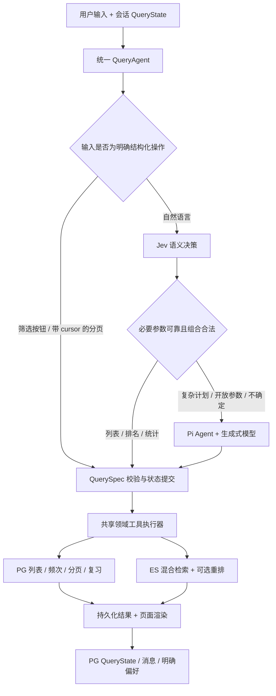

# Pi + Jev 深入调研：模型路由、源码定制与准确 Top N

- 日期：2026-10-04。
- 状态：本文保留实施前的研究基线。后续已引入 Pi 源码、实现查询 MVP，并在 L20 部署与评测 Laya；仍未接入官方 Jev API。
- 关联：[Pi 接入 spec](./2026-10-04-pi-agent-spec.md)。涉及自然语言路由、源码依赖及 Top N 的设计以本次修订为准。
- 最新实施与开源选型结果见 [spec 第 16 节](./2026-10-04-pi-agent-spec.md#16-查询-mvp-实施记录) 和 [开源部署实测](./2026-10-04-open-system-one-deployment.md)。下文“当前”均指研究时的改造前基线。

## 1. 三个问题的结论

1. **自然语言查询应由 Agent 中的模型判断意图和会话状态变化。** 确定查询计划后，类别列表、总数、频次和分页由 SQL 执行。Jev 可作为快速决策组件，复杂或不确定的计划交给 Pi 中的生成式模型处理。结构化按钮请求已经表达确定意图，可以直接执行。
2. **可以引入 Pi 源码以支持定制。** 建议固定完整上游快照，通过 git subtree 纳入 `vendor/pi`，只构建/运行 telemetry、ai、agent 依赖链；应用逻辑优先使用现有 hooks。定制补丁与上游代码分开记录，构建应证明运行的是本地源码。
3. **“前 40 个频率最高的算法题”可以做成准确的数据库查询，但当前自然语言入口还不能正确完成。** 本轮隔离实验验证了统计函数支持 40 条；现有 Agent 仍请求 20 条且最终切成 5 条，旧 ALGORITHM 标签还包含工程代码。

“正确”需要同时满足：意图、数量、类别、上下文范围、计数、排序和展示。Jev 或 Pi 输出了合法类型，仅完成其中一部分。

## 2. Jev 的已验证能力

### 2.1 产品与接口

Jev 是 TypeSafe 的 System One 决策模型，通过 `POST https://api.typesafe.ai/v1/systemone` 接收 `state`、`model` 和 `questions`，返回逐问题的 typed answers。公开接口提供以下三种原语：

| 原语 | 返回 | 本项目候选用途 |
| --- | --- | --- |
| Choice | 封闭选项中的 choice、分布、confidence；最多 255 个选项 | 意图、工具/查询类型、分类方向、状态更新操作、候选参数选择 |
| Noul | 命题为真的概率，0–1；没有独立 confidence 字段 | 是否明确指定数量、是否要沿用筛选、是否存在未支持限制 |
| Score | 有序等级的概率加权值、分布、confidence；2–10 级，可返回非整数 | 复杂度、候选相关性或证据支持程度 |

它不是通用 JSON 对象生成器。问题集合和选项由应用定义，应用将答案编译为自己的 QuerySpec。[API reference](https://docs.typesafe.ai/api)、[Primitives](https://docs.typesafe.ai/primitives)

Jev 不生成自由文本、代码或通用对话流，不能直接替换 Pi 使用的生成式模型。官方也明确将它定位为 Agent 内部的决策组件。[Jev with coding agents](https://docs.typesafe.ai/introduction/coding-agents)

### 2.2 调研时的模型信息

2026-10-04 官方 Models 页面列出 `jev-1.13.0`，latest/preview 当前指向此版本。公开价格为输入 $0.042 / 百万 tokens，输出不计费；文档列出请求总上下文 64k、state 加最长单问题 32k，以及动态调整的限额。接入验证时必须重新确认账户可用模型与实际限制。[Models](https://docs.typesafe.ai/models)

建议评测与初期部署固定版本 ID，记录响应中的实际版本，不使用会自动漂移的 latest 作为可复现实验基线。此次没有核验账户开通情况、账单或真实请求表现。

介绍文章报告的 70–500ms 与数十到数百倍收益是供应商实验结果；其评估地点、参照模型和任务形态与本项目不同，不能直接写为项目性能。文章发布时仍为 early access。[介绍文章](https://typesafe.ai/blog/introducing-system-one-models-and-jev)

### 2.3 中文适配是首要实证问题

官方明确说明英文是主要训练语言，CJK 输入可处理但准确率较低。本项目查询、题目、公司别名和会话大多为中文，所以应先验证中文完整计划准确率；不能因英文演示很快就默认适配成功。[State](https://docs.typesafe.ai/concepts/state)

候选指令可比较“中文 instructions/criteria”和“英文 instructions/criteria + 原始中文 state”；仅把有限类别说明翻译成英文不需要另一次模型调用。默认增加 LLM 翻译步骤会侵蚀速度和成本，需要单独评估。

## 3. 推荐的 Agent 结构



这里的 QueryAgent 是应用统一的控制器，包含 Jev 快速决策和 Pi 复杂推理两个分支。不是每轮都执行 `Pi Agent.prompt()`，但每个自然语言请求都由模型理解；不会再靠“含手撕就等于 ALGORITHM”的关键词规则决定业务类别。

Agent 判断的是本轮需要做什么、继承/替换/清除什么条件、指代什么范围。宿主负责参数合法性、事务、版本一致性及最终状态写入。模型无需每轮输出整份历史，PG 仍是会话事实源。

### 3.1 Jev 与 Pi 的三种结合方式

| 方式 | 特点 | 建议 |
| --- | --- | --- |
| QueryAgent 先调用 Jev，必要时调用 Pi | 没有前置的生成式模型调用；两分支共享状态/工具/事件 | **优先验证**。语义路由在 Agent 控制器内，工程边界清楚 |
| 把 Jev 注册为 Pi 工具，由 LLM 决定何时调用 | 接法简单，但普通查询先多花一次 LLM 判断 | 用于复杂任务中的相关性/证据判断，不作为默认首轮路由 |
| 修改 Pi 流程或 stream adapter，以 Jev 决策合成 tool calls | 所有请求可统一进入 Pi loop，但需自行处理模型事件、usage、终止与回退 | 后续源码定制候选。不是官方原生 Jev provider；要以测试证明兼容 |

先测第一种，再决定是否值得定制第三种。没有必要为了让每轮都走同一个函数，把 Jev 伪装为文本生成模型。

## 4. Jev 如何判断路由与会话状态

### 4.1 state 的内容

只提供当前 message、相关前一轮摘要、QueryState、显示页/结果集合引用、候选参数和明确偏好。避免加入整份原文、全题库、全部聊天历史。state 可以是 JSON；每个问题看到同一 state，但彼此独立求值。[State](https://docs.typesafe.ai/concepts/state)

提议问题集合：

| 决策字段 | 选项/含义 |
| --- | --- |
| `intent` | LIST / RANK / STATS / SEARCH / DETAIL / REVIEW_READ / REVIEW_WRITE / OTHER |
| `conversation_action` | NEW_QUERY / REFINE / PAGINATE / INSPECT_RESULT / RESET / UNKNOWN |
| `task_family` | ENGINEERING_CODE / ALGORITHM_CODE / SQL / ALL_CODING / KEEP / NONE / UNKNOWN |
| `ordering` | OCCURRENCE_FREQUENCY_DESC / INTERVIEW_FREQUENCY_DESC / IMPORTANCE / GAP / RELEVANCE / KEEP |
| `reference_scope` | CURRENT_PAGE / TOP_N_SET / FULL_FILTER_SET / NAMED_QUESTION / NONE / UNKNOWN |
| `company_operation` | KEEP / SET / CLEAR / UNSUPPORTED_COMBINATION |
| `requested_count` | 从候选数字 span 中选一个，或 NOT_STATED / UNKNOWN |
| `unsupported_constraint` | 原句是否包含当前工具无法表达的限制 |

选项是应用设计，名称本身不能替代具体说明。API 文档说明 question ID 不参与模型推断，因此每个 instructions 要明确指向 `state.message`、`state.current_query` 等字段，criteria 写清排除条件。[API reference](https://docs.typesafe.ai/api)

一个请求可同时问这些原子问题，减少 HTTP 次数；但独立求值不保证组合一致。编译器必须拒绝“下一页 + 新筛选仍沿用旧 cursor”等冲突，也不能把单字段置信度相乘当成完整计划的准确率。

### 4.2 状态变化需要表达 keep/set/clear

“只看腾讯”是新增公司条件，通常保留编码方向及排序；“换成算法题”替换编码方向；“不限公司”清除公司；“下一页”继承计划并消费 cursor。“这些未掌握的呢”默认作用于当前显示集合，“这类全部”作用于筛选全库。

每个更新都记录来源消息及 old/new 值。明确输入优先于会话与长期偏好。模型判断 keep/set/clear，程序验证并落库；单次临时筛选不自动更新长期偏好。

如果当前 FilterSpec 只能表达单公司等值，而用户要求“腾讯和字节，排除一面”，需要扩展对应领域契约或明确返回未支持状态，不能在回退后继续丢掉限制。Pi 回退同样受工具能力约束。

### 4.3 置信度如何使用

Choice 的官方计算为 `confidence = (p_max - 1/n) / (1 - 1/n)`。它不是“该次查询正确的概率”，且会受选项数量影响。例如二选一 p_max=0.9 时 confidence=0.8。应同时记录原始分布、选项/指令版本及任务级正确率。[Confidence](https://docs.typesafe.ai/confidence)

只有执行路径需要的字段通过验证才接受计划。低置信、必要候选缺失、状态冲突或未支持条件进入 Pi；仍无法确定时才澄清。阈值按中文验证集和任务类型选择，不直接照搬官方示例的 0.6/0.85。[Confidence-gated routing](https://docs.typesafe.ai/patterns/confidence-routing)

不能把多个字段的平均置信度作为接收标准，否则高置信的意图可能掩盖低置信的数量/公司。应测“完整计划全部正确”的选择性准确率与自动执行覆盖率。

## 5. 数量、日期和开放参数：不能遗漏的接入工作

### 5.1 “前 40 个”怎么得到精确的 40

官方 function-calling cookbook 根据 Literal 枚举生成 Choice。其普通 int 参数不会生成问题，会沿用函数默认值。直接照搬会保留“用户说 40，系统却使用默认 limit”的缺陷。[Function calling](https://docs.typesafe.ai/cookbooks/function_calling)

本项目采用候选选择：

1. 代码从当前句子找出数字/中文数词及位置、原句上下文；不要把 2026、近 3 月、LeetCode 40 都当成结果数量。
2. Jev 从候选中判断哪个表示请求题数，返回 span ID，或 NOT_STATED/UNKNOWN。
3. 代码按原文解析选中的值为整数，再检查范围与单位。Jev 不做算术，不使用 Score 插值得到 40。
4. 检测到显式数量但没有可靠选择时交给 Pi。不能静默套默认 20；超过单页上限则分批展示或明确说明。

这是官方“代码预解析候选、模型选择、代码精确复制与归一化”的模式在题数上的应用。[Pre-parsed value extraction](https://docs.typesafe.ai/cookbooks/pre_parsed_value_extraction_cookbook)

### 5.2 日期与开放文本

公司/题型/topic 等有限值可做 Choice。日期可选择候选 span 或拆分年月日/相对期间，日历计算由代码完成；“最近三个月”继续按现有日历月函数解析，公开具体时间范围。[Date extraction](https://docs.typesafe.ai/cookbooks/date_extraction_cookbook)

自由文本语义检索 query、任意备注、复杂复合限制，优先将原始 message 作为 query，或交给 Pi 生成受限参数。候选超过 Choice 上限时须先缩小候选或回退，不得截断后把剩余候选视为不存在。

## 6. Pi 源码如何引入并保持可维护

### 6.1 选择源码快照

调研基线：Pi v1.0.2，提交 `cd32f7725fdbddbaecdff5b1e68491563394e0ca`。[Release](https://github.com/earendil-works/pi/releases/tag/v1.0.2)

| 方式 | 好处 | 代价 |
| --- | --- | --- |
| npm 固定版本 + 应用扩展 | 安装简单，直接使用稳定公开 API | 源码修改需另做补丁/发布，本仓库没有可评审的完整上游快照 |
| Git submodule 指向固定 commit/维护 fork | 上游边界清楚，源码历史完整 | clone、CI、Docker 要处理子模块；漏初始化会导致构建失败 |
| Git subtree 引入固定快照 | 普通 checkout 即有源码，便于单仓库开发与 Docker 构建 | 仓库变大，升级需处理上游与本地补丁 |

结合当前单仓库、小规模部署和未来定制需求，建议 subtree。版本及来源写入 `vendor/pi.UPSTREAM.json`；保持上游许可证和版权声明。[MIT License](https://github.com/earendil-works/pi/blob/cd32f7725fdbddbaecdff5b1e68491563394e0ca/LICENSE)

### 6.2 引入源码不等于把整个 Coding Agent 放进产品

建议目录：

```text
vendor/pi/                      # 固定上游源码快照
vendor/pi.UPSTREAM.json          # 上游 URL、tag、commit、更新记录
vendor/pi-patches/               # 必要的运行时补丁及原因
services/pi-agent/               # 本项目 QueryAgent、Pi 适配、context、工具与事件
src/interview_intelligence/     # 现有 Python 领域服务及 Jev gateway
```

运行依赖只需要 `pi-agent-core`、`pi-ai` 及 `pi-telemetry`。其余上游源码用于保留构建上下文/升级参考，不开启 CLI、文件、shell 或编码工具。`pi-agent-core` 依赖 ai，ai 依赖 telemetry；只复制 agent-loop.ts 不足以保持真实依赖关系。[Agent package](https://github.com/earendil-works/pi/blob/cd32f7725fdbddbaecdff5b1e68491563394e0ca/packages/agent/package.json)、[AI package](https://github.com/earendil-works/pi/blob/cd32f7725fdbddbaecdff5b1e68491563394e0ca/packages/ai/package.json)

实施建立集成 npm workspace，将本地三个 Pi packages 和 `services/pi-agent` 纳入依赖图，按 telemetry → ai → agent 构建，保留上游 tsconfig、模型数据和 runtime assets。上游根 build 脚本面向完整 monorepo，不应原样用作本项目最小构建。ai 的离线构建路径仍需验证所需模型数据完整性。[构建脚本](https://github.com/earendil-works/pi/blob/cd32f7725fdbddbaecdff5b1e68491563394e0ca/package.json)

构建验收必须检查 Node resolve 的包路径和 lockfile：三个 Pi 运行包均来自 vendor 源码，不能复制了一份源码却实际仍运行 npm registry 中的旧版本。干净环境构建、Docker 安装和升级后重新做该检查。

### 6.3 哪些定制应先用 hooks

| 定制 | 已有扩展点/应用层职责 |
| --- | --- |
| 上下文裁剪、结构化状态注入 | `transformContext`、`prepareRequest` |
| 工具参数验证后的约束检查、幂等意图保存 | `beforeToolCall` |
| 工具摘要、来源、终止行为 | `afterToolCall`、工具 result |
| SQL 结果直接返回、停止额外回答生成 | `terminate`、`finishTurn` |
| 阶段事件、持久化、流式页面结果 | `subscribe`，宿主执行回调 |
| Jev 首轮路由、QuerySpec 编译、SQL 统计 | 本项目 QueryAgent 与 Python 服务 |

这些能力已在 v1.0.2 类型和实现中核对。[Agent types](https://github.com/earendil-works/pi/blob/cd32f7725fdbddbaecdff5b1e68491563394e0ca/packages/agent/src/types.ts)、[Agent implementation](https://github.com/earendil-works/pi/blob/cd32f7725fdbddbaecdff5b1e68491563394e0ca/packages/agent/src/agent.ts)

只有公开 hooks 无法表达的循环行为才修改 runtime，例如新增统一的 decision-provider step。每个补丁需要单独说明缺失能力、改动接口、上游测试及升级冲突；尽量让应用业务和题型规则不进入第三方源码。

## 7. Top 40 的正确语义与当前实证

### 7.1 当前代码能做到什么

本轮通过 PowerShell stdin 执行只读研究脚本，使用 SQLite 内存库构造 55 个标准题、70 场面试：50 个算法求解题，5 个模拟旧分类的工程组件题。频次覆盖不同数值；模型调用为 0，未向本机真实数据库写入。

| 检查 | 结果 |
| --- | --- |
| `StatsRequest(question_type="ALGORITHM", sort="frequency", limit=40)` | 返回 40 条 |
| 返回顺序与每题 occurrence_count 对照 fixture 真值 | 全部正确 |
| 旧 ALGORITHM 范围中的工程组件题 | 5 条进入 Top 40，证明类型范围仍混杂 |
| `AgentService.chat("前40个频率最高的算法题")` | 最终返回 5 条 |
| Agent 调用 stats 的 limit | 20；没有解析用户的 40 |

原因对应：[默认 limit=20](../../src/interview_intelligence/agent/service.py:28)、[算法分支最终切片](../../src/interview_intelligence/agent/service.py:110)、[StatsRequest 支持 1–100](../../src/interview_intelligence/contracts/__init__.py:65)、[频次排序与切片](../../src/interview_intelligence/analytics/stats.py:206)、[旧分类规范](../../prompts/extract_question_v1.md:21)。

此实验验证现有统计语义和控制流，不验证真实语料标签质量、原文证据质量、模型解析能力或 PostgreSQL 性能。题库自然语言入口当前还走语义 search，不会自动调用该 SQL 排名服务。[前端入口](../../src/interview_intelligence/web/assets/app.js:93)

### 7.2 新查询计划

示例计划是应用设计，Jev 分字段判断后由编译器组装，或由 Pi 返回同一受限契约：

```json
{
  "intent": "RANK",
  "question_scope": {
    "response_form": "CODE",
    "coding_focus": ["ALGORITHM"]
  },
  "metric": "OCCURRENCE_COUNT",
  "order": "DESC",
  "top_n": 40,
  "page_size": 40,
  "tie_policy": "EXACT_N_STABLE",
  "source": "PUBLISHED_CORPUS"
}
```

“频率”默认指真实提问次数，即符合全部筛选的 occurrences 数。标准题 ID 聚合，同题多种问法计入同一题的频次；默认输出 40 个唯一标准题，而非 40 次原始提问。用户明确说“最多面试场次”时改用 distinct interview 数。

### 7.3 SQL 必须先统计全范围，再取前 N

在有效 build、analytics_eligible、任务标注及全部筛选范围中聚合，按 count DESC、canonical ID ASC 排序后 limit 40。用相同筛选计算总题数、总 occurrences。任务标签为多值关系时使用 EXISTS 或 distinct occurrence，避免 join 放大次数。

不能先做向量 Top K，再对这 K 条排频次；后者只得到候选内部排名，可能遗漏全库最高频的题。结果同时返回排序指标、次数、匹配来源、筛选及版本。算法题依据已验证的任务标签；没有 LeetCode 号仍可纳入，纯工程代码和只问算法原理按定义排除。

数据未补齐或归并不准确时，只能保证“当前已发布数据范围中的 Top 40”。覆盖率、未知标注及范围要可见，不能宣称等于所有原始面经的真实 Top 40。

### 7.4 Top N 与分页要分别建模

`top_n=40` 表示选中的整个结果集合；`page_size=20` 仅表示当页加载数。可直接展示 40 条，也可两页 20 条。后一页到第 40 条后停止，并提供查看全部的明确动作；不能因默认页大小 20 把请求变成 Top 20。

返回 `scope_total`、`requested_top_n`、`selected_total=min(N, scope_total)`、`returned_count`、`rank_start/rank_end`、next_cursor。只有 27 题时返回 27，并说明不足 40；不能补造题目。默认并列按稳定 ID 截断为精确 N；“并列全部保留”作为不同策略，返回数可超过 N。

页面按服务端 rows 渲染；模型可以解释范围，但不能再次摘要截断为 5/10 项。原文匹配代表例应来自本次筛选的 occurrence，避免 canonical 标题遮蔽实际编码要求。

### 7.5 这类指令的操作顺序不能混淆

| 指令 | 正确顺序 |
| --- | --- |
| 前 40 个最高频算法题 | 类别/上下文过滤 → 全范围聚合 → 排序 → Top 40 |
| 未掌握的算法题里频率最高的 40 个 | 先过滤未掌握 → 聚合排序 → Top 40 |
| 这前 40 个里哪些未掌握 | 先固定 Top 40 集合 → 查复习状态 → 过滤，结果可能少于 40 |
| 只看腾讯，前 40 个 | 在同一 occurrence 上先公司过滤 → 聚合排序 → Top 40 |
| 最近三个月前 40 个 | 先按公开日期口径/半开时间区间过滤 → 聚合排序 |

这些顺序由模型识别、QuerySpec/工具组合表达，执行器验证。只返回一个 route 字段无法满足此类查询。

## 8. Python Jev Gateway 的接入路径

新增 `DecisionProvider.interpret(message, state, candidates, deadline)`，提供 Jev 和现有生成式模型两种实现。Node QueryAgent 调用 Python 内部 decision endpoint；复杂分支仍进入 Pi 和现有生成式模型网关。

首期可选官方 `typesafe-sdk` 的 AsyncTypeSafeClient + Choice/Noul，或用现有 httpx 直接调用 REST。官方异步客户端文档使用 `httpx2` 类型，不能假设与项目当前 httpx transport 可直接互换；依赖锁定前核验 Python/Pydantic/httpx2 的依赖兼容。[Python SDK](https://docs.typesafe.ai/sdk/python)、[Async client](https://docs.typesafe.ai/sdk/python/api/clients/async)

如果只有一个 endpoint，REST 适配能减少依赖，但需自行完成请求/响应校验、模型列表、错误码、usage 与取消。使用 SDK 时显式配置 `RetryPolicy(max_retries=0)`，重试由项目统一预算控制。[RetryPolicy](https://docs.typesafe.ai/sdk/python/api/retries)

所有 Jev 请求也进入现有 ModelCallGate。当前约束为全模型串行、请求结束后间隔 2 秒；新增独立服务并不会消除排队。Jev 接上后，自然语言 SQL 路径通常是一次 decision 调用 + SQL；明确结构化动作仍为零模型请求。回退链会额外付出模型调用和间隔等待。

分别记录 queue_wait、interval_wait、Jev provider 时间、编译、SQL、fallback、页面完成时间。只有未来明确调整并发政策后，才能评估 provider 分组限流；本方案不自行绕过现有全局约束。

Jev 响应缓存绑定模型/问题集/选项版本、message、相关 QueryState、候选集合及偏好版本。上下文中的“这些”涉及结果版本时必须纳入 cache key。记录字段级概率及最终 fallback 原因，便于定位误判。

## 9. Jev 的扩展用途与优先级

| 用途 | 建议优先级 | 条件 |
| --- | --- | --- |
| 意图、状态更新和参数候选选择 | P0 | 中文端到端 QuerySpec 金标通过，确认回退后的总成本 |
| 工程编码/算法标注辅助 | P1 | 逐 occurrence 判断、有证据及人工核验；批量回填独立预算 |
| 语义结果相关性重排/证据支持 | P2 | 与现有 reranker 在相同检索金标上比较，不影响频次排序 |
| 判断是否保存长期偏好 | P2 | 仅明确用户意图；宿主决定实际保存范围 |

官方有 Jev 重排 cookbook，但其任务是英文法律检索，不能当作中文面经收益。示例按候选对分别发请求，并发跑评测；照搬到当前串行门会增加多次调用及间隔。若试验批量多问题，一次携带多候选，仍须评测输入长度/干扰和相关性。[Re-ranking cookbook](https://docs.typesafe.ai/cookbooks/rerank_typesafe)

“保证类型合法”并不等于语义判断永远正确。官方 jaggedness 文档明确列出数值、日期、间接指代、冗长 state、选项顺序及对抗内容等失败模式。[Jev 1.13 jaggedness](https://docs.typesafe.ai/model-jaggedness/jev-1.13)

## 10. 评测与简历亮点

### 10.1 需要做的对照

比较三条路径：现有关键词规则、Pi/现有模型直接生成受限查询计划、Jev 计划 + Pi 回退。使用同一标注集及同一 SQL/检索工具，避免不同数据与执行器造成混淆。

建议先建 200–300 条中文查询/多轮样本，拆分开发与保留测试集；涵盖题数、中文数字、年份/题号干扰、否定、公司别名、手撕歧义、keep/set/clear、集合指代和操作顺序。测试集不得用于选择阈值；标注冲突人工裁决。

报告 route accuracy、必要参数 exact match、完整 QuerySpec exact match、最终 Top N ID/顺序/次数准确率、会话更新准确率；同时报告 auto-execution coverage、接受集合错误率、fallback/clarification 比例、概率校准、P50/P95、实际调用数和总成本。

误判成本按字段区分。静默漏掉数量、公司、时间或排除条件应单独列为严重错误，不能被总体 route accuracy 掩盖。Choice 选项顺序置换、中文同义改写和无关上下文扰动应有稳定性测试。

### 10.2 为什么能成为亮点

亮点来自可说明、可复现的工程成果：

- 快速决策与复杂推理分工，基于实测置信度/完整计划校验进行回退。
- SQL 全库统计与语义检索的统一工具层，区分 ranking/top_n/page_size 和操作顺序。
- 结构化会话状态、版本快照和来源证据，支持多轮条件修改及准确结果引用。
- Pi 固定源码快照与有限 runtime 定制，能解释改了哪些 hooks/循环逻辑、为何需要及如何验证。
- 中文评测、质量/延迟/成本对照，包含错误案例及运行约束。

完成后的简历表述可按真实指标填写：“基于 Pi 源码构建面经查询 Agent，引入 Jev 结构化决策与生成式模型回退，统一 SQL 统计和混合检索；通过 QuerySpec 校验、会话状态及版本分页实现 Top N/多轮查询，完整计划准确率 X、端到端 P95 Y、模型调用/成本降低 Z。”当前不能填写尚未实现或测量的数值，也不能将供应商的速度或‘无幻觉’宣称写作项目结果。

## 11. 下一阶段验证顺序

1. 先建立上述中文查询金标和完整 QuerySpec，包含“前 40 个”及多轮操作顺序。
2. 引入固定 Pi 源码、完成本地包解析与干净构建；复用 hooks 跑通一个领域工具。
3. 验证 Jev 账户/API/固定模型与中文决策，比较直接 Pi 路由及 Jev 回退的完整计划、延迟和成本。
4. 同步改造任务标签/回填和 SQL Top N/分页；以人工核验类别及 fixture 真值验证执行器。
5. 在统一 QueryAgent 下接入两入口与会话状态，再做真实 provider、全局 gate、取消与浏览器验证。

若 Jev 在中文任务上没有达到质量门槛，保留相同 DecisionProvider/QuerySpec 接口，由 Pi 的生成式模型承担路由。这个结果仍有研究价值，但不能呈现为已获得 Jev 加速收益。
