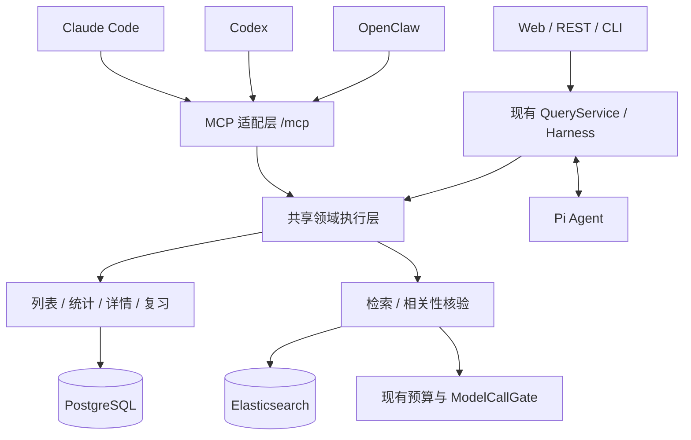

# 面经研习接入 Claude Code / Codex / OpenClaw 的 MCP 调研

- 日期：2026-10-08（北京时间）。
- 范围：当前工作区代码审查、官方文档核实、接口与落地方案设计。
- 状态：调研建议；尚未实现 MCP Server，也未在三个客户端完成连接验收。
- 代码基线：包含当前未提交的检索修订；本文不修改已有业务代码或客户端配置。

## 1. 结论

**可以接入，建议把系统建设成可供不同 Agent 调用的面试知识与复习服务。** 首先提供类型化的查题、列表、统计、详情和复习状态工具；外部 Agent 负责组织对话，系统负责查询口径、来源证据、版本与持久化。现有 Web 与 Pi Agent 可以继续作为另一种使用入口。

这次集成的主要工作是新增 MCP 适配层、抽取共享业务执行策略和建立调用边界。无需重做 PostgreSQL 事实库、Elasticsearch 检索或导入流水线。但也不能仅给几个现有函数添加装饰器：预算、相关性核验、过滤来源、分页版本和复习权限分散在 API / QueryService / Harness 中，需要一起保留。

| 客户端 | 当前官方支持 | 本项目建议 |
| --- | --- | --- |
| Claude Code（CC） | 原生 MCP client，支持 stdio、Streamable HTTP，并兼容旧 SSE | 连接统一的 HTTP `/mcp`；本地进程分发可再提供 stdio。[官方文档](https://code.claude.com/docs/en/mcp) |
| Codex | CLI、IDE 与桌面本地客户端可配置 MCP；官方列出 stdio、Streamable HTTP，支持 Bearer / OAuth | 使用 HTTP；不把旧 `/sse` 当作已验证的共同能力。[OpenAI Docs](https://learn.chatgpt.com/docs/extend/mcp?surface=cli) |
| OpenClaw | 当前官方已提供原生 MCP client，支持 stdio、SSE、Streamable HTTP，配置为 `mcp.servers` | 直接配置本系统；不必把 mcporter 设成必需中间层。[官方文档](https://docs.openclaw.ai/tools/mcp) |
| 其他支持 MCP 的 Agent | 能力取决于具体客户端、运行时、协议与网络环境 | 以基础 Tools 和结构化 JSON 为共同接口，逐个验收 |

“客户端官方支持 MCP”与“当前这台机器的已安装版本支持某项功能”是两个结论；本文核实了前者，后者留给接入验收。OpenClaw 原生运行时与外部 harness 也存在差异，不能据此保证所有 ACP 路径可按会话注入 MCP。[OpenClaw 入口说明](https://docs.openclaw.ai/cli/mcp)

## 2. 当前代码已经具备的基础

以下均为现有代码事实，路径相对仓库根目录，行号用于当前工作区定位。

| 能力 | 代码位置 | 对 MCP 的意义 |
| --- | --- | --- |
| 类型化筛选与严格校验 | `src/interview_intelligence/contracts/__init__.py:13`、`:42` | 已有 Pydantic 模型，可作为输入契约基础；仍应生成简单、客户端可接受的 schema |
| 完整范围列表、Top N、排序、签名分页 | `analytics/listing.py:20`、`:113` | 可直接复用 SQL 查询；游标绑定用户、筛选、语料、分类和复习版本 |
| 分组与时间统计 | `analytics/stats.py:130` | 频次来自完整事实，不依赖 RAG 返回条数 |
| 题目详情、原始问法与来源 | `analytics/detail.py:45`、`:80` | 适合详情和证据工具 |
| BM25 / Dense / Hybrid / Rerank | `search/service.py:39` | 复用召回和事实补全，不必启动 Pi 进行自然语言规划 |
| 相关性核验与降级结果口径 | `agent/query_service.py:487` | 不能只包装底层检索，遗漏 `VERIFIED / UNVERIFIED / UNAVAILABLE` 语义 |
| 过滤条件来源策略 | `agent/query_service.py:89`、`:112`、`:148` | 已区分用户明确筛选、可信继承和模型推断；新入口必须有对应语义 |
| 复习状态与记录 | `review/service.py:21`、`:43` | 已有按用户读写、幂等回执、可选版本冲突检查 |
| 调用期限、取消与模型预算 | `providers/runtime.py:10`、`:54` | MCP 执行时必须建立请求上下文并复用模型调用门 |
| 会话事件、状态与取消 | `agent/journal.py:8` | 可用于后续完整 Agent 委托或异步任务适配 |
| 现有领域工具适配 | `services/pi-agent/runtime.mjs:5`、`:39` | 已有六个领域工具，但通过私有 HTTP 回调执行，尚不是 MCP |

表中省略目录前缀的 Python 文件均位于 `src/interview_intelligence/`。

现有 `/api/questions/search`、`/api/questions/list`、`/api/questions/stats`、题目详情及 `/api/review` 提供了入口基础。不过 HTTP search 与 QueryService 的核验、降级行为并不完全相同，首版不能机械地把所有 REST 路由自动变成 MCP 工具。

## 3. 推荐架构



这里的“共享领域执行层”是建议新增的 facade。它负责主体身份、输入校验、筛选来源、快照版本、预算、审计、异常转换和结果裁剪，向下调用已有服务；无需做成独立微服务。

**优先将 HTTP MCP 挂载到现有 FastAPI 进程。** 当前系统已经通过 Compose 管理数据库、索引和模型调用，外部客户端连接一个端点更便于复用这些运行条件。官方 Python SDK 支持 ASGI / FastAPI 挂载，顶层应用需要正确管理 MCP 生命周期与路由顺序。[SDK 挂载文档](https://py.sdk.modelcontextprotocol.io/run/asgi/)

补充 stdio 时可以共享同一 facade，也可以实现只转发到既有后端的轻量适配进程。若另起直连数据库的 MCP sidecar，它与 API / worker 的模型限流锁必须共享同一实际运行文件，不能因容器路径同名而误以为共享锁。

## 4. 两种产品形态

| 形态 | 外部 Agent 做什么 | 系统做什么 | 建议 |
| --- | --- | --- | --- |
| 领域工具 | 理解需求、澄清、组合调用、生成复习计划或模拟面试 | 返回事实、证据、统计、个人状态，约束写入 | 首版主入口；减少重复规划，便于组合其他工具 |
| 完整 Agent 委托 | 调用 `interview_ask_agent` 并使用结果 | 继续由 QueryService / Pi 规划、维护领域会话和反馈记忆 | 后续可选；适合需要复用完整系统对话策略的用户 |

直接调用领域工具可以省掉系统内部的查询规划模型步骤，但 Dense / Hybrid 仍可能调用 embedding，相关性核验仍可能调用模型。**接入 MCP 不会自动消除检索成本或改善召回质量。**

完整 Agent 委托需要明示额外延迟、领域会话 ID、版本冲突及记忆保存规则。返回“待澄清问题与选项”即可由客户端继续对话；首版不必依赖所有客户端都实现 MCP elicitation / sampling。

## 5. 首版工具契约建议

以下名称与参数是待实现的设计，不是当前已经存在的 MCP 接口。使用 `interview_` 前缀，减少与客户端其他工具撞名。

| 工具 | 主要输入 | 主要输出 / 约束 |
| --- | --- | --- |
| `interview_get_capabilities` | 无 | 筛选枚举与分类版本、可用检索管线、语料/索引状态、长度与分页上限；不输出密钥、文件系统路径或完整模型账单 |
| `interview_search_questions` | query、filters、semantic_hints、pipeline、top_k | 相关题、证据摘要、实际筛选、执行管线、核验状态和降级说明；默认 10 条，上限不超过现有 50 |
| `interview_list_questions` | filters、sort、top_n、page_size、cursor、review_statuses | SQL 完整范围列表、真实总数与下页游标；默认 20 条，页上限不超过现有 100 |
| `interview_get_stats` | filters、group_by、topic_level、time_bucket | SQL 统计、样本口径、时间范围、分类覆盖；不同统计形态分别复用已有统计/分组列表能力 |
| `interview_get_question` | canonical_question_id、filters、证据条数上限 | 标准题、原始问法、发生次数与有界来源摘录 |
| `interview_get_review_state` | canonical_question_ids | 当前认证主体的状态与版本；批量大小受限 |

可以在第二阶段增加 `interview_get_evidence`，通过题目或已授权证据标识读取更长的原文片段；它应限制行数与字节数。核心证据先随详情返回，不要求客户端会读取自定义 Resources。

`interview_record_review` 放在写入阶段：输入明确的题目 ID、状态、笔记、幂等键和每题的 `items[].expected_version`。MCP 入口建议把版本检查设为必需，避免三个客户端同时复习时静默覆盖。当前 create 操作校验每个 ReviewItem 的版本，顶层 expected_version 用于 resolve，不能替代逐题版本。批量写入沿用现有每批最多 20 条的限制。

不建议首版开放任意 SQL、任意文件路径读取、全库导出、分类发布、重建索引或导入管理。它们需要独立的管理员能力边界，不属于日常查题工具集。

## 6. 必须保留的查询语义

1. **SQL 列表和语义召回分开。** “字节二面 Redis 高频前 20 题”调用完整范围列表；“与线程安全缓存实现相关的题”调用检索。不能把 RAG Top K 的数量当作全库总数或频次。
2. 公司、轮次、题型等组合条件继续要求命中同一次 occurrence，保留现有事实模型口径。
3. 返回 `applied_filters`、`corpus_revision`、`task_annotation_revision`、`user_state_revision`、`as_of` 和分页信息。编码分类继续说明 `KNOWN / VERIFIED` 与覆盖范围，不能把机器分类当人工核验。
4. MCP 的结构化参数来自调用方 Agent，不能自动标成现有 `explicit_ui`。建议新增 `explicit_caller` 来源表示调用方明确提交的硬筛选；模型推断放在 `semantic_hints`，默认不升级成硬筛选。工具说明和响应同时展示实际应用条件。这是查询语义设计，无需用户逐项审批只读筛选。
5. 保留 QueryService 的相关性核验口径：验证失败或未完成不得包装成“已核验相关题”。原始候选模式可以显式提供，但应标记未核验。局部核验成功时继续报告结果可能不完整。
6. 游标是签名的不透明值；客户端原样传回。语料、分类或用户状态版本变化返回 `SNAPSHOT_CHANGED`；筛选或用户范围不匹配返回 `INVALID_CURSOR_SCOPE`（现有 HTTP 分别为 409、400），不能偷偷接续另一份结果集。当前省略 cursor 与传 null 都从第一页开始。

HTTP 部署需要固定、持久化的 `APP_SIGNING_KEY`；当前未配置时由应用随机生成，重启或多个进程会导致旧游标验证失败。现有 scope 默认有效期一小时，MCP 契约应明确过期后重新查询。

MCP 输出建议使用结构化结果并附有界文本摘要，兼容只把文本内容交给模型的运行时。列表只返回必要字段；详细原文按需读取。相对 `/api/...` 来源链接需要转换成配置好的公开访问基址，或者改用可解析的证据标识；不能把 Docker 内网地址当作用户可打开的链接。

## 7. 传输、SDK 与运行环境

**默认 Streamable HTTP；stdio 作为本地分发补充。** 现有业务 SSE 是查询进度流，不能仅改 URL 就当 MCP。MCP 需要自己的协议发现/协商、Tools 描述、调用与错误结构；这些交给官方 SDK。[MCP 传输规范](https://modelcontextprotocol.io/specification/2025-11-25/basic/transports)

2026-10-08 查阅的官方 Python SDK 首页已将 v2 标为稳定线；2026-07-28 与旧握手协议存在差别，SDK 文档说明同一 HTTP 应用可兼容两代客户端。实施时应冻结具体 SDK 版本与依赖，按选定版本 API 编码，不能混用早期 `FastMCP` 示例与新 `MCPServer` API。首版不依赖新协议独有特性。[SDK 首页](https://py.sdk.modelcontextprotocol.io/)、[协议版本](https://py.sdk.modelcontextprotocol.io/protocol-versions/)、[旧客户端兼容](https://py.sdk.modelcontextprotocol.io/run/legacy-clients/)

部署时要按客户端实际执行位置配置地址：

- Windows 本机客户端连接宿主机已映射端口，可以使用 `127.0.0.1`。
- 运行在容器、远程 Gateway 或其他主机上的客户端，其 `127.0.0.1` 指向它自己，需要对应的服务地址或安全隧道。
- 云端执行环境必须能到达服务；桌面能够连接不代表云端可以连接。
- stdio 模式把日志写到 stderr，stdout 只承载 MCP 消息；否则客户端可能无法解析。

## 8. 客户端配置示例

**以下只展示待实现端点的配置结构，不表示目前已经可用。** 使用同一个本地服务 `http://127.0.0.1:8000/mcp`，并在客户端/进程环境设置独立的 `INTERVIEW_MCP_TOKEN`。

### Claude Code

`.mcp.json` 片段：

```json
{
  "mcpServers": {
    "interview": {
      "type": "http",
      "url": "http://127.0.0.1:8000/mcp",
      "headers": {"Authorization": "Bearer ${INTERVIEW_MCP_TOKEN}"}
    }
  }
}
```

也可使用 `claude mcp add --transport http interview <URL>` 注册；正式使用时补上认证。配置字段与环境变量展开见 [Claude Code 官方文档](https://code.claude.com/docs/en/mcp)。

### Codex

`config.toml` 片段：

```toml
[mcp_servers.interview]
url = "http://127.0.0.1:8000/mcp"
bearer_token_env_var = "INTERVIEW_MCP_TOKEN"
startup_timeout_sec = 30
tool_timeout_sec = 120
enabled_tools = [
  "interview_get_capabilities", "interview_search_questions",
  "interview_list_questions", "interview_get_stats",
  "interview_get_question", "interview_get_review_state"
]
```

120 秒是待验证的客户端等待上限示例；不应通过不断加长超时掩盖慢检索。服务端应在更短的执行期限内返回成功、失败或任务状态。[OpenAI Docs：MCP](https://learn.chatgpt.com/docs/extend/mcp?surface=cli)、[配置参考](https://learn.chatgpt.com/docs/config-file/config-reference)

### OpenClaw

配置合并片段：

```json
{
  "mcp": {
    "servers": {
      "interview": {
        "enabled": true,
        "url": "http://127.0.0.1:8000/mcp",
        "transport": "streamable-http",
        "connectionTimeoutMs": 5000,
        "requestTimeoutMs": 120000,
        "toolFilter": {
          "include": [
            "interview_get_capabilities", "interview_search_questions",
            "interview_list_questions", "interview_get_stats",
            "interview_get_question", "interview_get_review_state"
          ]
        }
      }
    }
  }
}
```

此片段省略凭据值，认证需另按官方支持的 Header / secret 配置补齐；OAuth 服务也可配置 `auth: "oauth"` 并登录。诊断使用 `openclaw mcp doctor interview --probe`。客户端的 `toolFilter` 只控制工具暴露，服务端仍应强制执行读权限。[注册表文档](https://docs.openclaw.ai/cli/mcp/registry)、[传输与认证](https://docs.openclaw.ai/cli/mcp/transports)

mcporter 可用于 CLI、脚本、Skill 工作流或旧环境兼容；它的注册表与原生 `mcp.servers` 独立，不能配置其中一处就假定另一处生效。[mcporter 官方仓库](https://github.com/openclaw/mcporter)

## 9. 身份、写入和任务边界

当前 API 在 `api.py:173-184` 等位置使用固定的 `settings.local_user_id`；`api.py:199-204` 的 Bearer 验证针对内部 Agent 回调。代码尚未提供通用的外部主体认证与语料租户隔离。

首版可以定位为个人工作区：独立 MCP 凭据映射到一个已配置主体，默认只读；跨 CC / Codex / OpenClaw 使用相同主体时，复习状态可以共享。需要区分日志时使用不同客户端凭据映射到同一主体。**不要向客户端分发 `INTERNAL_AGENT_TOKEN` 或模型供应商密钥。**

HTTP 接口应校验认证、Host / Origin 和允许的工具；绑定本机的配置保留回环地址。跨主机使用 HTTPS 或已建立的安全隧道；公开服务再引入用户认证与 OAuth，不能将静态个人 token 方案称为完成 MCP OAuth 授权规范。真正的多用户语料隔离还需要数据模型和查询授权改造，不是增加一个 `user_id` 参数就完成。[传输保护要求](https://modelcontextprotocol.io/specification/2025-11-25/basic/transports)、[MCP 授权规范](https://modelcontextprotocol.io/specification/2025-11-25/basic/authorization)

外部模型传入的 `user_id`、`write_authorized: true` 或工具注解不能作为服务端授权依据。复习写入应有独立 scope / 可选启用开关，服务端核验题目可见性、版本和幂等键。若要保留“只修改当前结果中的题目”规则，可基于现有签名 scope 增加绑定主体和题目集合的写入范围令牌；这项写入令牌机制尚需实现，现有 `result_set_id` 不能直接当作已授权写令牌。

客户端审批体验由各宿主决定，MCP 无法证明一条自然语言修改指令确实来自人。首版默认不开写入；开启后遵循明确工具语义、最小范围与可追溯回执。引用原文是数据，不能让其中的指令改变权限或触发其他工具。

协议连接标识、领域 `conversation_id`、异步 `run_id` 与用户身份分别管理；某些新协议连接没有协议级 session，也不影响服务端继续保存领域会话。

慢检索初期可以有界同步返回；执行周期必须设置并清理 `RequestLimits/current_limits`、trace 和模型审计上下文，复用同一个 ModelCallGate。客户端断开与显式取消的处理应按 SDK 协议语义实现，不能假设每种断线都表示用户取消。

后续完整 Agent 委托可提供 `start / get / cancel` 工具并复用 QueryJournal，而非要求客户端一直等待一条调用。现有事件已持久化，但 API 的 `live_tasks` 和 QueryService 的 `runs` 仍在进程内（`api.py:441`、`agent/query_service.py:81`），不能宣称已具备生产级多进程任务调度与自动恢复。导入使用另一套 `PipelineRun` / worker，已有孤儿任务恢复，但尚无导入取消接口；若开放导入 MCP 工具，应分别适配，不能直接视为 QueryJournal 任务。MCP 本身也不等于复习提醒调度器，定时触发需要 OpenClaw / Codex 或独立调度层。

## 10. 与 Skill、CLI、REST 及反向集成的关系

| 接入方式 | 适合承担的职责 | 本项目选择 |
| --- | --- | --- |
| MCP Server | 跨 Agent 的工具发现、类型化参数、事实调用与认证入口 | 主要能力接口 |
| Skill / Prompt | 指导怎样选题、逐题模拟面试、评分后经授权保存状态 | 可配套提供；业务事实仍通过工具获取 |
| CLI | 终端调试、脚本与本地维护 | 保留已有 `ii`，按需增加机器可读 JSON |
| REST / OpenAPI | Web、其他应用与网关集成 | 保留，与 MCP 共享 facade 和错误语义 |
| 完整 Agent 委托 | 将系统的规划、澄清和记忆整体交给其他宿主调用 | 后续可选工具 |

接入后，CC / Codex 可以查题并结合当前项目代码训练回答；OpenClaw 可以在其支持的聊天入口组织练习和提醒。这些是可构建的工作流，接入 MCP 后不会自动产生，需要宿主指令、Skill 或调度配置。

本文的方向是“外部客户端调用本系统”。反向“本系统驱动这些 Agent 执行任务”需另外选协议：OpenClaw 的 `openclaw mcp serve` 是反向会话桥；现行 OpenAI CLI 文档已将旧 `codex mcp-server` 标为移除并指向 app-server，不能直接套用旧示例。[OpenClaw serve](https://docs.openclaw.ai/cli/mcp/serve)、[Codex CLI 参考](https://learn.chatgpt.com/docs/cli/reference#codex-mcp-server)

## 11. 实施顺序与验收

1. **只读 PoC**：冻结 SDK；抽取 facade；接入身份、输入上限、输出裁剪和统一错误；提供六个只读工具与 HTTP 端点。先以 MCP Inspector / SDK client 验证协议，再接 CC / Codex / OpenClaw。
2. **检索策略对齐**：验证现有过滤来源、相关性核验失败、部分核验、索引落后、预算耗尽、取消与快照变化；不能只验收“有返回 JSON”。
3. **个人复习写入**：独立启用写权限、必需版本、幂等、结果范围和回执；验证并发修改与客户端重试不重复记录。
4. **按真实需求扩展**：补证据读取、Skill、stdio 或完整 Agent 委托；公开多用户部署另行设计认证、隔离和容量。

最小验收场景：

- “字节二面 Redis 高频前 20 题”：SQL 总数、排序、分页与原 API 口径一致，查询规划不调用内部 Pi。
- “找与线程安全缓存实现相关的题”：保留实际筛选和核验证据；未核验候选不会冒充已核验结果。
- “下一页”：同主体、同快照接续；篡改、跨主体和版本变化被拒绝。
- 题目详情：引用可回到正确原文位置，长来源有输出上限。
- 未授权写入、伪造主体、模型构造写授权字段被拒绝；合法重复写返回同一回执，并发旧版本不覆盖新状态。
- 三个客户端分别记录实际版本、执行位置、协议协商、认证方式、工具调用与超时结果；资源/提示增强项单独登记。

首版收益是更广的使用入口、可组合的知识能力和复习状态复用。现有召回与分类质量边界、模型调用延迟、生产级任务恢复仍需按各自问题继续改进，MCP 接入不改变原质量门禁结论。
